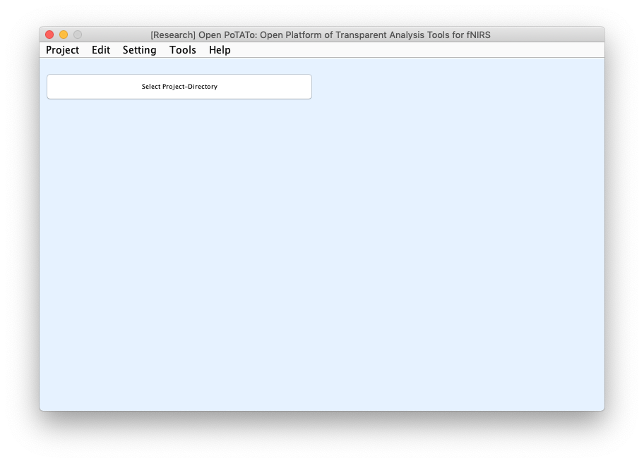
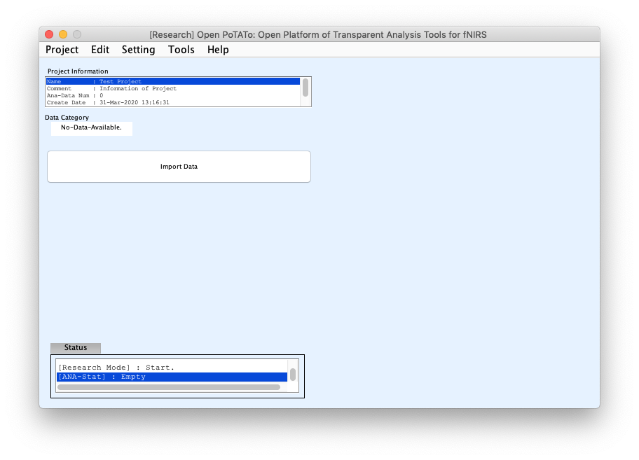
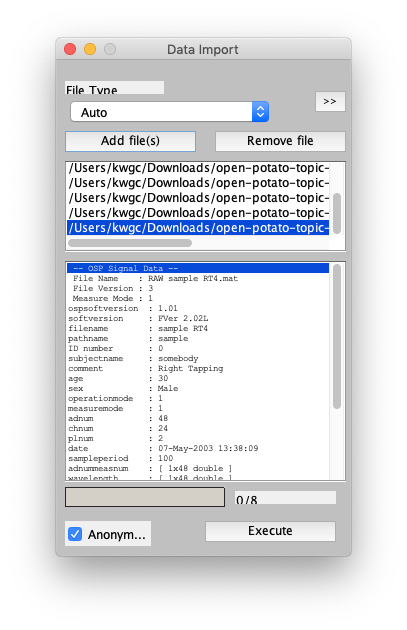
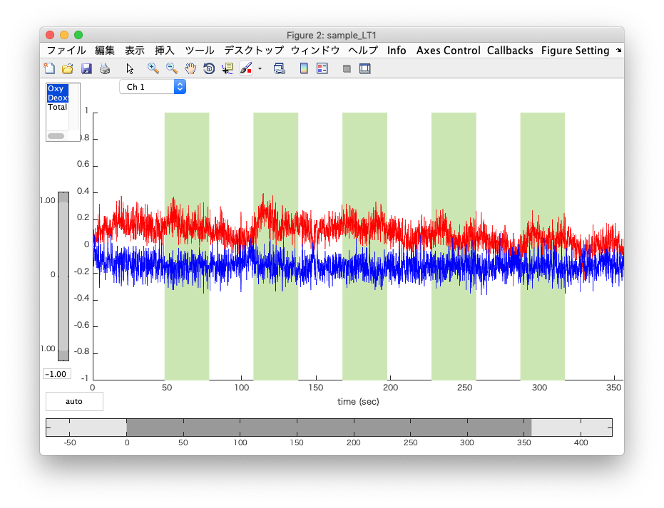

# Launching Open PoTATo for the first time
<!-- TOC -->

- [Launching Open PoTATo for the first time](#launching-open-potato-for-the-first-time)
    - [Creating a Project Directory](#creating-a-project-directory)
    - [Creating a Project](#creating-a-project)
    - [Importing and displaying data](#importing-and-displaying-data)

<!-- /TOC -->
## Creating a Project Directory

The first time you run Open PoTATo, a window will appear prompting you to configure a **Project Directory**. An operation guide will also be displayed. Click the button labeled **[Select Project-Directory]** in the window and select any desired folder on your computer. Open PoTATo will use this folder as the Project Directory. The Project Directory folder is used to store projects, which contain RAW data to be analyzed and analysis-related data such as analysis results. The procedure for creating a project is described in the next section.



```

### Supplementary explanation  ###

In environments in which multiple users use the same system, a separate Project Directory can be configured for each user to eliminate the risk of users damaging other users’ data.

After the Platform is started, the Project Directory can be changed from the Setting menu -> “Project Directory” on the main window.

If there is already analysis data in a Project Directory, it can be automatically recognized and read.

```

<!-- The information beyond this point is the same as that in the [Step-by-step guide] (Step-Guide.md)  -->

## Creating a Project

Once you have created a Project Directory, the **[Make Project]** button will appear in the window.


 Click the **[Make Project]** button to open the **Project Manager** dialog window. Projects can be made from this dialog window. It is a good practice to create separate projects for units of data that make the data easy to manage, such as separating projects by experiment theme. Enter the project name in the “Project Name” field, the operator’s name in the “Operator” field, etc., and enter any comments in the “Comment” field. Note that the only characters that can be used here are **single-byte characters** that can be used in folder names and file names. Click the **[New]** button at the bottom right of the dialog window to create the project.


## Importing and displaying data

Once the project has been created, the main window display will change, and the project’s information will be displayed at top left.  Click the **[Import Data]** button to display the **Data Import** dialog window. This is used to import data.



 Click the **Add file(s)** button on the **Data Import** dialog window to select file(s).


There is sample data in the **man/sample/folder** in the folder in which Open PoTATo was installed. Select all and click the **Open** button at bottom right.


A list of files will be displayed in the **Data Import** dialog window. The contents of the files can be checked from the dialog window. Click the **Execute** button at bottom right to load the files and close the dialog window.



When the data is displayed, the main window will be updated. A list of the data that was read in will be displayed at left center.

In Open PoTATo, the main window is used like this to filter and display data. For details regarding operating procedures, please refer to other manuals.

Now, let’s try to display a graph. Select one item of data and click the **[Draw]** button at the bottom right of the main window.


This graph is the Ch1 waveform for the selected “sample LT1” data. In addition to graphs like this, data can be displayed in various other ways.



Now, let’s try loading some of your own data. Please proceed to the [Installing loading plug-ins] (InstallPrepro.md) manual, which explains how to install plug-ins provided by different companies.

To try operating Open PoTATo using sample data, please proceed to the [Open PoTATo first step-by-step guide] (Step-Guide.md).

[Open PoTATo Document List] (index.md)

