# 基本操作

[Open PoTAToドキュメントリストへ](index.md)


<!-- TOC -->

- [基本操作](#%E5%9F%BA%E6%9C%AC%E6%93%8D%E4%BD%9C)
- [概要](#%E6%A6%82%E8%A6%81)
    - [解析モード](#%E8%A7%A3%E6%9E%90%E3%83%A2%E3%83%BC%E3%83%89)
    - [起動と終了](#%E8%B5%B7%E5%8B%95%E3%81%A8%E7%B5%82%E4%BA%86)
- [Open PoTAToのデータ](#open-potato%E3%81%AE%E3%83%87%E3%83%BC%E3%82%BF)
    - [実験データ](#%E5%AE%9F%E9%A8%93%E3%83%87%E3%83%BC%E3%82%BF)
        - [ヘモグロビン濃度変化](#%E3%83%98%E3%83%A2%E3%82%B0%E3%83%AD%E3%83%93%E3%83%B3%E6%BF%83%E5%BA%A6%E5%A4%89%E5%8C%96)
        - [時間情報と刺激情報](#%E6%99%82%E9%96%93%E6%83%85%E5%A0%B1%E3%81%A8%E5%88%BA%E6%BF%80%E6%83%85%E5%A0%B1)
        - [位置情報](#%E4%BD%8D%E7%BD%AE%E6%83%85%E5%A0%B1)
        - [実験情報](#%E5%AE%9F%E9%A8%93%E6%83%85%E5%A0%B1)
        - [その他の情報](#%E3%81%9D%E3%81%AE%E4%BB%96%E3%81%AE%E6%83%85%E5%A0%B1)
    - [データと解析手順の関係](#%E3%83%87%E3%83%BC%E3%82%BF%E3%81%A8%E8%A7%A3%E6%9E%90%E6%89%8B%E9%A0%86%E3%81%AE%E9%96%A2%E4%BF%82)
- [実験データの読み込みと管理](#%E5%AE%9F%E9%A8%93%E3%83%87%E3%83%BC%E3%82%BF%E3%81%AE%E8%AA%AD%E3%81%BF%E8%BE%BC%E3%81%BF%E3%81%A8%E7%AE%A1%E7%90%86)
    - [プロジェクトの作成](#%E3%83%97%E3%83%AD%E3%82%B8%E3%82%A7%E3%82%AF%E3%83%88%E3%81%AE%E4%BD%9C%E6%88%90)
    - [実験データの読み込み](#%E5%AE%9F%E9%A8%93%E3%83%87%E3%83%BC%E3%82%BF%E3%81%AE%E8%AA%AD%E3%81%BF%E8%BE%BC%E3%81%BF)
        - [詳細設定](#%E8%A9%B3%E7%B4%B0%E8%A8%AD%E5%AE%9A)
- [データの検索](#%E3%83%86%E3%82%99%E3%83%BC%E3%82%BF%E3%81%AE%E6%A4%9C%E7%B4%A2)
    - [基本的な検索とデータ情報の確認](#%E5%9F%BA%E6%9C%AC%E7%9A%84%E3%81%AA%E6%A4%9C%E7%B4%A2%E3%81%A8%E3%83%87%E3%83%BC%E3%82%BF%E6%83%85%E5%A0%B1%E3%81%AE%E7%A2%BA%E8%AA%8D)
    - [正規表現を利用した検索](#%E6%AD%A3%E8%A6%8F%E8%A1%A8%E7%8F%BE%E3%82%92%E5%88%A9%E7%94%A8%E3%81%97%E3%81%9F%E6%A4%9C%E7%B4%A2)
- [メインウィンドウメニュー](#%E3%83%A1%E3%82%A4%E3%83%B3%E3%82%A6%E3%82%A3%E3%83%B3%E3%83%89%E3%82%A6%E3%83%A1%E3%83%8B%E3%83%A5%E3%83%BC)
    - [Projectメニュー](#project%E3%83%A1%E3%83%8B%E3%83%A5%E3%83%BC)
        - [Newメニュー](#new%E3%83%A1%E3%83%8B%E3%83%A5%E3%83%BC)
        - [Openメニュー](#open%E3%83%A1%E3%83%8B%E3%83%A5%E3%83%BC)
        - [Modifyメニュー](#modify%E3%83%A1%E3%83%8B%E3%83%A5%E3%83%BC)
            - [Renameメニュー](#rename%E3%83%A1%E3%83%8B%E3%83%A5%E3%83%BC)
            - [Importメニュー](#import%E3%83%A1%E3%83%8B%E3%83%A5%E3%83%BC)
            - [Exportメニュー](#export%E3%83%A1%E3%83%8B%E3%83%A5%E3%83%BC)
            - [Mergeメニュー](#merge%E3%83%A1%E3%83%8B%E3%83%A5%E3%83%BC)
            - [Removeメニュー](#remove%E3%83%A1%E3%83%8B%E3%83%A5%E3%83%BC)
        - [Data Import メニュー](#data-import-%E3%83%A1%E3%83%8B%E3%83%A5%E3%83%BC)
        - [Exitメニュー](#exit%E3%83%A1%E3%83%8B%E3%83%A5%E3%83%BC)
    - [Edit メニュー](#edit-%E3%83%A1%E3%83%8B%E3%83%A5%E3%83%BC)
        - [Copy Data メニュー](#copy-data-%E3%83%A1%E3%83%8B%E3%83%A5%E3%83%BC)
        - [Data Delete メニュー](#data-delete-%E3%83%A1%E3%83%8B%E3%83%A5%E3%83%BC)
    - [Setting メニュー](#setting-%E3%83%A1%E3%83%8B%E3%83%A5%E3%83%BC)
        - [Stim-Diff-Limit メニュー](#stim-diff-limit-%E3%83%A1%E3%83%8B%E3%83%A5%E3%83%BC)
        - [My Filter List メニュー](#my-filter-list-%E3%83%A1%E3%83%8B%E3%83%A5%E3%83%BC)
        - [Project Directoryメニュー](#project-directory%E3%83%A1%E3%83%8B%E3%83%A5%E3%83%BC)
        - [P3 Mode メニュー](#p3-mode-%E3%83%A1%E3%83%8B%E3%83%A5%E3%83%BC)
    - [Tools メニュー](#tools-%E3%83%A1%E3%83%8B%E3%83%A5%E3%83%BC)
        - [Layout Editor メニュー](#layout-editor-%E3%83%A1%E3%83%8B%E3%83%A5%E3%83%BC)
        - [Plugin Wizard メニュー](#plugin-wizard-%E3%83%A1%E3%83%8B%E3%83%A5%E3%83%BC)
        - [Position Setting メニュー](#position-setting-%E3%83%A1%E3%83%8B%E3%83%A5%E3%83%BC)
        - [Reset Layout メニュー](#reset-layout-%E3%83%A1%E3%83%8B%E3%83%A5%E3%83%BC)
        - [Project Repair メニュー](#project-repair-%E3%83%A1%E3%83%8B%E3%83%A5%E3%83%BC)
    - [Help メニュー](#help-%E3%83%A1%E3%83%8B%E3%83%A5%E3%83%BC)
        - [About POTATo メニュー](#about-potato-%E3%83%A1%E3%83%8B%E3%83%A5%E3%83%BC)
        - [Help メニュー](#help-%E3%83%A1%E3%83%8B%E3%83%A5%E3%83%BC)
- [Open PoTAToのデータフォーマット](#open-potato%E3%81%AE%E3%83%87%E3%83%BC%E3%82%BF%E3%83%95%E3%82%A9%E3%83%BC%E3%83%9E%E3%83%83%E3%83%88)
    - [連続データのフォーマット](#%E9%80%A3%E7%B6%9A%E3%83%87%E3%83%BC%E3%82%BF%E3%81%AE%E3%83%95%E3%82%A9%E3%83%BC%E3%83%9E%E3%83%83%E3%83%88)
    - [区間データのフォーマット](#%E5%8C%BA%E9%96%93%E3%83%87%E3%83%BC%E3%82%BF%E3%81%AE%E3%83%95%E3%82%A9%E3%83%BC%E3%83%9E%E3%83%83%E3%83%88)

<!-- /TOC -->


# 概要

Open PoTAToの起動方法と基本操作について説明します。また、Open PoTAToを使った解析の概要を説明します。

Open POTATo では実験データを選択し、解析手法、描画方法を設定することにより解析を行います。最初に解析の準備として、Open POTATo の起動・実験データの読込を行います。実験データはPoTATo データと呼ばれる形式で保存されます。 解析時にデータを選択する場合は、検索が利用できます。 解析手法以降の操作は解析モードにより異なりますので、別章で説明します。また、Open POTATo への機能追加に関しても別章で説明します。


## 解析モード

Open PoTAToにはNormal, Research, Developersの３つのモードが存在します。

Normalモードでは実験データ、既存の解析手法（レシピ）、表示方法（レイアウト）の3つを選択することにより、煩雑な設定なしに解析を実行することができます。

Researchモードは解析手法を組み合わせることによりユーザーが独自の解析するためのモードです。Normalモードでは解析手法を選択できるだけですが、Researchモードでは解析を行う関数やパラメータを変更できます。また、解析関数を組み込む（プラグイン）ことにより、新しい解析関数を導入することが可能です。

Developersモードは主にプラットフォーム開発者が試験的に用いるモードで、通常利用しません。

本書では、主にNormalモードとResearchモードについて説明します。以下の表に、各モードとその内容についてまとめます。


| 状態              | 内容                                          |
| ----------------- | --------------------------------------------- |
| Normal モード     | あらかじめ定めた手順で解析する。              |
| Research モード   | 解析の手順をカスタマイズする。                |
| Developers モード | プラットフォーム開発者向け。 通常利用しない。 |


## 起動と終了

Matlabを起動します。

MATLAB 起動後、P3 をインストールしたディレクトリに移動し、Command Window 上で P3 とタイプ し、Enter キーを押してください。


PoTAToが起動すると、下記のようなメインウィンドウが表示されます。


終了する場合は、ウィンドウを閉じるためのボタンを押してください。また、Project メニューの Exit を押しても終了します。


# Open PoTAToのデータ

## 実験データ

fNIRSでは脳の表面付近の血液量の変化を計測します。近赤外光を脳表面に照射し、離れた位置で検出される近赤外光の量(吸光度)を検出します。 このとき、照射位置から検出位置まで光が通った箇所にある物質や濃度の違い、測定波長によって吸光度が変わります。 

このことを利用して、fNIRSでは2波長以上の近赤外光の吸光度の変化量から頭部組織の血液にあるオキシヘモグロビンおよびデオキシヘモグロビンの濃度の変化量(正確にはヘモグロビンの濃度変化量と光路長の積)を計算します。実験データとして装置から出力されるものは、吸光度やヘモグロビン濃度変化です。また、照射位置や検出位置を複数設けて計測することもできます。

fNIRSの実験や解析に関連する情報として、実験内容や被験者の情報などがあります。


### ヘモグロビン濃度変化

各時刻、各測定位置におけるオキシ/デオキシヘモグロビンの変化量を取得します。


### 時間情報と刺激情報

血流変化の計測は連続的に行われます。ひとつの計測から次の計測までの時間をサンプリング間隔といいます。
Open PoTAToで行うfNIRSの実験モデルでは、ある時刻に被験者に何らかの刺激を与え、その刺激による血流の変化を調べます。そのため、いつ、どのような刺激を行ったかというデータが重要となります。そこで、刺激時刻、刺激の種類、刺激前の時間、刺激後の時間が重要となります。

Open PoTAToでは、刺激がある時刻に行われたか、それともある時間枠をもっておこなわれたか、により名称を変えています。ある時刻に起こった刺激をEvent,ある程度の時間幅をもって行われた刺激をBlockと定義しています。
これを図にすると下記のようになります。BがEvent、A,CがBlockです。


### 位置情報

fNIRSでは複数の測定位置からデータを取得することがあります。ここで各々の測定位置のことをチャンネルと呼んでいます。

チャンネルの位置情報はデータの表示や管理に使われます。

### 実験情報

実験や解析に関連するデータとして、被験者の情報や、実験開始時刻、情報 整理のための番号、コメント等があります。これらはデータの整理に使用されます。

### その他の情報

fNIRS装置から出力されるデータは、複数の波長の近赤外光の吸光度です。 その時の検出器のゲイン等、測定に関わる情報があります。また、fNIRSと同時に測定できる被験者の心拍や実験の動画等なども有用な情報です。


## データと解析手順の関係

Open PoTATo で1つの実験データを解析するときの流れを下図で示します。


まず、装置から出力された実験データを読み込みます。これは、Open PoTAToで**連続データ**として取り込まれます。この連続データに対して、何かしらの解析処理をすると、連続データが更新されます。

また、連続データはブロッキング処理により**区間データ**に変換することができます。この区間データに対して、何かしらの解析処理をすると、 区間データが更新されます。

区間データは連続データから一定の区間のデータを取り出したものです。Open PoTAToではこの処理をブロック化(ブロッキング: Blocking)と呼びます。


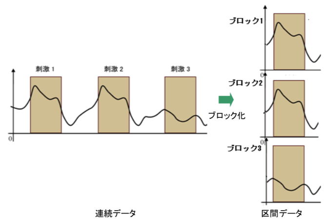


区間データには刺激時間のデータだけではなく、その前後の時間(Pre期間、Posr期間)のデータも含まれます。また、それぞれの区間データには固有の番号が割り当てられ、個々に区別できるようになっています。


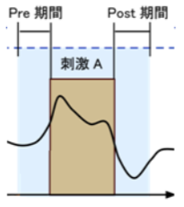


区間データでは各々の区間で同様な刺激をしていることを前提にしています。


# 実験データの読み込みと管理

Open PoTAToで解析を行うために実験データを読み込みむと、読み込んだ実験データはOpen PoTAToのデータ形式に変換・保存された上で、管理されます。Open PoTAToでは、いくつかの実験データをまとめて管理しています。このデータのまとまりのことを**プロジェクト**と呼びます。解析手順の一部を修正したときに全てのデータにその方法を一括して適用したりできます。

解析の前にデータを格納する”プロジェクト”を作成し、そのプロジェクトに実験データを読み込みます。


## プロジェクトの作成

Open PoTAToをインストールしたばかりのときにはProjectがありません。初めて起動したときには下図のようなウィンドウが起動します。


Projectを作成するには、[Make Project]ボタン(A)を押します。また、新規プロジェクトを作成するときはProject メニューから New を選択します。すると、プロジェクト作成ウィンドウが開きます。


(A)にプロジェクト名を、(B)に利用者名を、(C)にコメントを記述します。

プロジェクト名はプロジェクトを選択するときに利用されます。プロジェクト名に使える文字はそれぞれのOSのディレクトリ名に使えるもののみです。また、プロジェクト名を重複して設定することはできません。記入が済んだら、Newボタン(D)を押してください。問題が無ければ、正常にプロジェクトが作成され、新しいプロジェクトが開かれます。

```markdown
### ヒント ###
プロジェクトを細分化しすぎるとデータが分散し、管理が難しくなります。
また、大きくしすぎると処理が遅くなる、データ選択の操作が煩雑になるなどのデメリットが発生します。
実験プロジェクトごとに適切な管理をしてください。
```


## 実験データの読み込み

新規作成したプロジェクトに実験データをプロジェクトに読込み、解析データとして保存する方法を説明します。
Open PoTAToでは実験データを読み込むことをインポートと呼びます。新規作成したプロジェクトに実験データをインポートする場合はImport Dataボタン(A)を押します。ProjectメニューのData Importを選択してもに実験データをインポートできます。

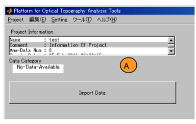

上記操作を実施するとData Importウィンドウが表示されます。

まず、データフォーマットを選択します。Open PoTAToでは複数のfNIRS装置が出力したフォーマットの実験データのを読み込むことができます。File Typeポップアップメニュー(A)から適切なデータフォーマットを選択してください。

次にインポートしたいファイルのリストを作ります。Add file(s)ボタン(B)を押してファイルを選択します。その結果、ファイル選択ウィンドウが表示されますのでfNIRS装置から出力されたファイルを選択します。インポートしたいファイルは複数選択することもできます。ファイルが選択されるとリスト(C)にファイルが追加されます。また、リスト(C)で選択中のファイルの情報は(D)の枠内に表示されます。選択中のファイルをリストから除く場合はRemove fileボタン(E)を押します。

次にリストにあるファイルをインポートします。インポートするときに、被験者名を匿名化するには Anonymous チェックボックス(F)をチェックします。Execute ボタン(G)を押すとインポートが開始されます。バー(H)で進捗状況を確認できます。

```markdown
### ヒント ###
ファイル読み込みには多少時間が掛かることがあります。
```


### 詳細設定

インポートのときに詳細な設定を行いたい場合は、Data Importウィンドウ右上にある [>>]ボタンをクリックします。クリックすると、以下のウィンドウが表示されます。


詳細設定では、ファイル読み込み後の付加的な処理の設定やデータ名のカスタマイズができます。(デフォルトではデータ名は実験ファイル名から自動的に生成されます。)

ファイル読み込み後の付加的な処理によって、実験データに情報を加えたり加工したりするできます。付加処理を行うときには、まず、追加で行いたい処理をポップアップメニュー(B)から選択します。オンラインヘルプがある場合、処理内容はヘルプボタン(C)で確認できます。追加したい処理を(B)で選択後、Add ボタン(D)を押してください。その結果、追加処理リスト(E)が更新されます。追加処理リストを編集するには(E)の右にある[UP]や[Enable]などのボタンを使います。

データ名をカスタマイズする場合には、[Rename with] チェックボックスに チェックをし、データ名の命名規則(F)を選択します。

また、詳細設定のメニューを閉じる場合は [<<]ボタン(A)を押してください。


# データの検索

Open PoTAToではプロジェクト内の多くのデータのなかから、データを検索できます。

Open POTATo には2種類の検索機能があります。1つはデータ名により絞り込む機能です。データ名に含まれる文字列を条件としてデータを検索します。もう1つ は拡張検索と呼ばれる機能です。解析データ内の被験者名、年齢などの条件で検索します。また、検索するための値を解析データに追加することも可能です。

まず、データ情報を確認する方法を説明し、データ名による検索機能について説明します。 なお、拡張検索機能に関してはマニュアル『拡張検索機能』をご参照ください。


## 基本的な検索とデータ情報の確認

メインウィンドウの左側にはデータの情報が表示されます。


Project Information (A) にはプロジェクトに関する情報が表示されます。

データを検索するときには検索ボックス(B)に文字列を入力します。(B)が空のときにはプロジェクトの全てのデータが(D)にリスト表示されます。(B)に文字列を入力してEnterキーを押すと、その文字列をデータ名に含むファイルだけが(D)に表示されます。

データリスト(D)をクリックするとデータを選択できます。データを選択すると選択しているデータの詳細な情報は(F)に表示されます。複数のデータを選択しているときには、ポップアップメニュー(E)で情報を表示するデータを切り替えることができます。

また、データに関する情報が(D)のリストやその周辺に表示されることもあります。例えば、上の図では選択中データ数/表示中データ数が(d1)に表示されています。

また、データリスト(D)でデータを選択すると、選択中のデータ数などから自動で解析状態 (ANA-Stat)が変わる場合があります。解析状態が変わるとステータスログ情報(G)に変更状況が追加されます。

また、ボタン(b1)を押すと拡張検索ができます。(このボタンは表示されていないこともあります。)


## 正規表現を利用した検索

検索ボックスに入力する文字列には正規表現を使うこともできます。正規表現とは文字列の集合を一つの文字列で表現する方法です。正規表現を使うと高度なデータの検索ができます。

正規表現を利用した検索の例として、下記の図のような名称を持つ10個のデータの検索を行います


例えば、この中から002, 003, 004のデータを取得したい場合には、"00[2-4]"と入力してください。そうすると、TEST 002, TEST 003などのデータのみが検索されます。

TEST もしくは COST を含むデータを取得したい場合、”(TEST)|(COST)”と入力してください。その結果、TEST_001~TEST_003, COST_001~COST_005 が表示されます。

同様に、最初の文字が T もしくは C で始まるデータを取得したい場合は”^[TC]”をと入力してください

検索に用いる正規表現は MATLAB の regexp 関数に従います。詳細は regexp のヘルプをご参照ください。上記の例の他にも様々な正規表現があります。


# メインウィンドウメニュー

メインウィンドウにはProject, Edit, Setting, Tool, Helpの5つのメニューがあります。


## Projectメニュー

プロジェクトに関する操作を行います。

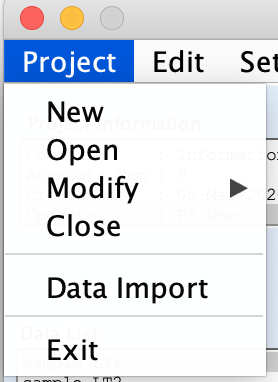

### Newメニュー

新たにプロジェクトを作成する際に実行します。詳細は[プロジェクトの作成](プロジェクトの作成)を ご参照ください。

### Openメニュー

Open メニューは既存のプロジェクトを開くときに使います。

メニューを選択すると下図のようなダイアログが開きます。

この時、ポップアップメニュー(A)からプロジェクトを選択して、Open ボタン(B)を押すと選択したプロジェクトが開きます。


### Modifyメニュー

プロジェクトを編集できまう。


#### Renameメニュー

Rename メニューはプロジェクトの名称を変更するときに使います。

Modify メニューの Rename を選択すると下図のようなダイアログが開きます。

このとき、Project Name エディットテキスト(A)のプロジェクト名を変更し、Edit ボタン(B)を押すと名称が変更 されます。また、Operator や Comment も変更できます。


#### Importメニュー

Import メニューはプロジェクトを取り込む時に使います。

ModifyメニューのImportを選択するとファイルを選択するダイアログが開きます。 zip形式で圧縮されたプロジェクトデータを選択してください。該当ファイルを選択すると下図のような Project Import ダイアログが表示されます。

内容を確認しインポートボタンを押すとインポートが開始されます。

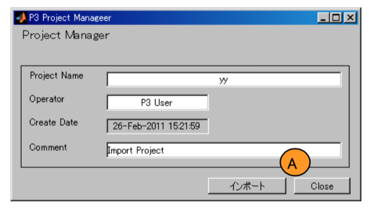


#### Exportメニュー

Export メニューはプロジェクトを外部へ出力する時に使います。

Modify メニューの Export を選択すると下図のようなダイアログが開きます。

この時、ポップアップメニュー(A)から出力するプロジェ クトを選択し、Export(エクスポート)ボタン(B)を押します。

そうするとファイル出力ダイアログが表示されるので、 ファイル名を記載します。

その結果既存のプロジェクトをエクスポートし、zip ファイルが作成されます。 ここで作成したファイルは Import メニューから読み込むができます。


#### Mergeメニュー

Merge メニューは現在開いているプロジェクトに別のプロジェクトのデータをすべて読み込み、1つにまとめる場合に使います。

Modify メニューの Merge を選択すると下図のようなダイアログが開きます。

この時、ポップアップメニュー(A)からマージしたいプロジェクトを選択し、Open ボタン(B)を押します。

そうすると選択したプロジェクト内のデータが、現在 開いているプロジェクトに追加されます。

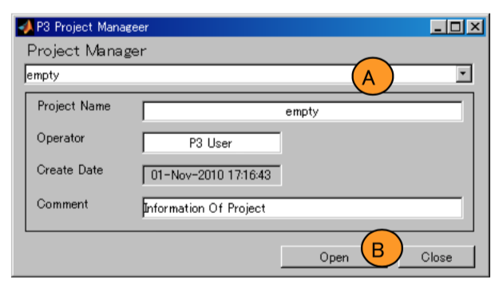


#### Removeメニュー

Remove メニューはプロジェクトを削除する際に使います。

Modify メニューの Remove を選択すると下図のよう なダイアログが開きます。

この時、ポップアップメニュー(A)から削除したいプロ ジェクトを選択し、Remove ボタン(B)を押すと、選択した プロジェクトが削除されます。

削除後は Close ボタンを押してください。


### Data Import メニュー

Data Import メニューは実験データファイルを読み込み、POTATo にインポートします。詳細は[実験データの読み込み](実験データの読み込み)をご参照ください。


### Exitメニュー

Exit メニューはOpen  PoTATo を終了します。


## Edit メニュー

Edit メニューではデータのコピー・削除を行います。


### Copy Data メニュー

データリストにあるデータを1つ選択し、 Copy Data メニューを選択すると下図のようなダイアログが開きます。

テキストボックス(A)にコピー先のデータ名を入力し、OK ボタン(B)を押します。テキストボックス(A)に記載した名前でデータがコピーされ、リストに追加されます。


### Data Delete メニュー

データリストにあるデータを1つ選択し、Data Delete メニューを選択すると選択中のデータを削除します。 削除するときには下図のような確認ダイアログが開きます。

選択したデータが統計的検定などの処理で利用されている場合は、依存関係から削除すべきデータをリストアップします。

削除してもよい場合は、Yesボタン(A)を、削除したくない場合 は Noボタン(B)を押してください。

また、常にYesとする場合は、Always ボタン(C)を押してください。


## Setting メニュー

Setting メニューは全般に影響する設定を行います。


### Stim-Diff-Limit メニュー

解析データを刺激毎に分け区間データにしたときの、各区間の時間が異なる場合があります。

Stim-Diff-Limit メニューではこの時間差の最大値を設定します。

Stim-Diff-Limit メニューを選択すると、下図のようなダイアログ が開きます。許容する最大時間差を msec 単位で 設定します。


### My Filter List メニュー

My Filter List メニューでは頻繁に利用する使うフィルタのリストを編集できます。My Filter List メニューを選択すると下図のようなウィンドウが表示されます。

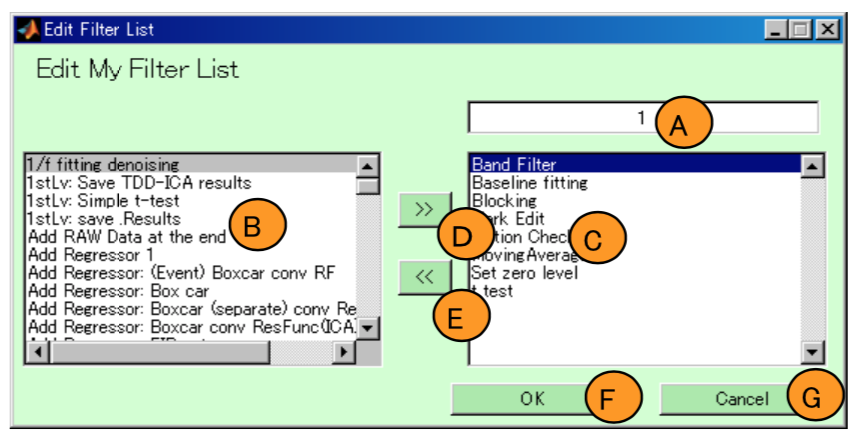

テキストボックス(A)にはフィルタリストの名称が表示されます。これを編集することでフィルタリストの名称を変更できます。ここでは例として「My Filters」という名称を使って説明をします。

左のリスト(B) には全てのフィルタが、右のリスト(C)にはMy Filtersのフィルタが表示されています。

My Filtersにフィルタを追加したいときは、左のリスト(B)から追加したいフィルタを選択し、[>>]ボタン(D)を押します。My Filtersから除外したいときは、右のリストで除外したいフィルタを選択し[<<]ボタン(E)を押します。

編集が終了したらOKボタン(F)を、キャンセルしたい場合は Cancel ボタン(G)を押すとウィンドウが閉じます。


### Project Directoryメニュー

Project DirectoryとはOpen PoTAToのプロジェクトを保存しているディレクトリのことです。Project Directory メニューでは、解析に使うProject Directoryを変更できます。

Project Directory メニューを選択すると、ディレクトリ選択ダイアログが開きます。解析に使う Project Directory を選択してください。

デフォルトのProject DirectoryはOpen PoTAToをインストールしたフォルダのop/Projectsディレクトリです。

**ヒント** ディレクトリ選択ダイアログは OS に依存します。ダイアログの詳細は MATLAB の uigetdir をご参照ください。また、Windows系OSでは、ディレクトリはフォルダとして表示されます。

```shell
### 警告 ###
同時に複数の Open PoTATo から1つの Projects Directory を操作した場合、データが破損する恐れがあります。そのため、複数ユーザが使用する環境ではユーザーごとにProject Directory を分けて操作してください。
```


### P3 Mode メニュー

Open PoTATo のモードを選択します。モードについて[解析モード](#解析モード)をご参照ください。


## Tools メニュー

ToolsメニューにはOpen  POTATo で利用可能なツールがリストアップされています。


### Layout Editor メニュー

描画方法を記録したレイアウトの編集ツールを起動します。レイアウトの編集方法は、マニュア ル『表示とレイアウト』をご参照ください。


### Plugin Wizard メニュー

POTATo にプログラムを組み込む(プラグイン)際の補助ツールを起動します。詳細は別紙『3 解析ツール作成のためのステップガイド.pdf』をご参照ください。


### Position Setting メニュー

本メニューをクリックすると、POTATo の位置設定ツールを起動します。詳細はマニュアル『位置 設定』をご参照ください。


### Reset Layout メニュー

Reset Layout メニューを押すと Layout ファイルの再検索を実施します。レイアウトファイルを手動でコピーした場合など、POTATo メインウィンドウにレイアウトが反映されていない場合に使うことができます。


### Project Repair メニュー

計算途中で PC がシャットダウンされたとき、なんらかの原因でプロジェクトのファイルが破損したときに修復を試みるツールを起動します。


全てのチェック、修復をする場合は All ボタン(A)を選択してください。 Fix Path ボタン(B)は内部データのパスの間違いを検出し、訂正します。 Check Relation ボタン(C)はデータの依存関係をチェックし、無効な依存関係を削除します。LostFile ボタン(D)は消失したデータを検知し完 全に削除します。Raw-Data Check ボタン(E)は不要なデータを削除します。exit ボタン(F)は Project Repair を終了します。

なお、依存関係が修復不可能なほど壊れている場合、Remake Relation ボタン(G)でファイルの依存関係を作成し直します。


## Help メニュー

ヘルプが表示されます。


### About POTATo メニュー

PoTAToのバージョンを表示します。


### Help メニュー

マニュアルを表示します。


# Open PoTAToのデータフォーマット

POTAToのデータフォーマットはヘッダとデータからなります。

## 連続データのフォーマット

連続データのデータ部は各時刻、各チャンネルにおけるオキシ/デオキシヘモグロビンの変化量で、 時系列×チャンネル×データの種類の3次元データです。

ヘッダ部分には刺激のあったタイミングや位置等、実験に関わるデータが入っています。

ヘッダは構造体で、具体的には以下のフィールドを持ちます。

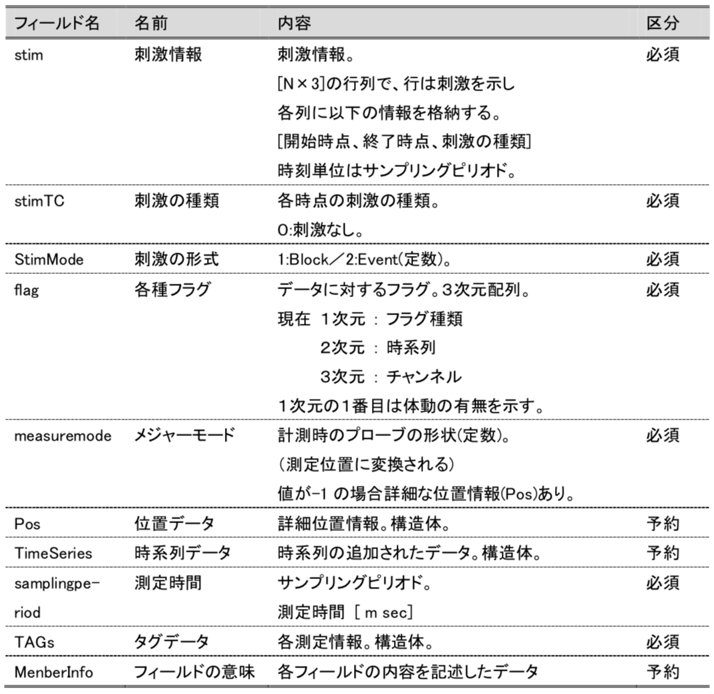

ここで、表の区分に必須と記載されているもの常に必要です。一方、予約と記載されているものはある場合とない場合があります。 また、必須でも予約でもないフィールドに関しては記載していません。


このなかでTAGs構造体は下記のフィールドを持ちます。


ここで、TAGs.data はfNIRSの実験装置に依存して内容が変わったり、場合によってはないこともあります。
TAGs.data の第2次元はチャンネル毎にN種類の波長のデータが入っているため、チャンネル×N の長さになります。
また、装置が出力したデータに記載されているもののうち POTATo データのフォーマットに記載されていないデータは新たにフィールドを作成することでPoTAToデータに含めることができます。例えば、波長は TAGs.wavelength として含めることができます。

位置情報はmeauremodeとPos構造体で管理しています。Pos構造体では詳細な位置情報を記録しています。一方、meauremodeはPos構造体を参照するか、規定の位置情報を参照するかを区別するための整数です。meauremodeが-1のときPos構造体の情報を参照します。また、下記の表に示されたmeauremode番号を指定すると照射・検出位置をM x Nの格子状としたときの配置を読み出します。

| meauremode番号 | 照射・検出位置の格子サイズ/内容 |
| -------------- | ------------------------------- |
| -1             | Pos構造体を参照                 |
| 1              | 3 x 3 (2箇所)                   |
| 2              | 4 x 4                           |
| 3              | 3 x 5                           |
| 50             | 8 x 8                           |
| 51             | 4 x 4                           |
| 52             | 3 x 5                           |
| 53             | 3 x 9                           |
| 54             | 3 x 11                          |
| 99             | Unknown                         |
| 199            | Unknown                         |
| 200            | 2 x 10                          |
| 201            | 2 x 8                           |
| 202            | 2 x 4                           |

例えば、measuremodeが2のときには、照射/検出位置が下左図のように4 x 4の格子状で配置されていることを示しています。この情報は解析結果をグラフで表示するときなどに参照されます。例えば、下右図では、meauremodeが2のときのグラフのレイアウトを示しています。

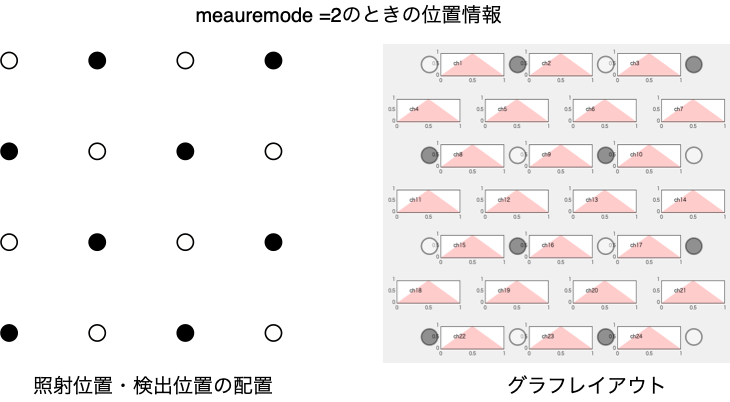


また、格子状のmeauremodeのグラフレイアウトはMATLABで確認することもできます。グラフレイアウトの確認にはtime_axes_position関数を使います。

```matlab
time_axes_position(m, [1 1], [0 0],1);
```

mにはmeauremode番号を指定します。

measuremodeが-1のときは、Pos構造体を使って詳細な位置情報を管理します。下記の表はPos構造体の内容です。2次元の情報のほかに、位置デジタイザなどで取得した3次元座標を読み込むこともできます。

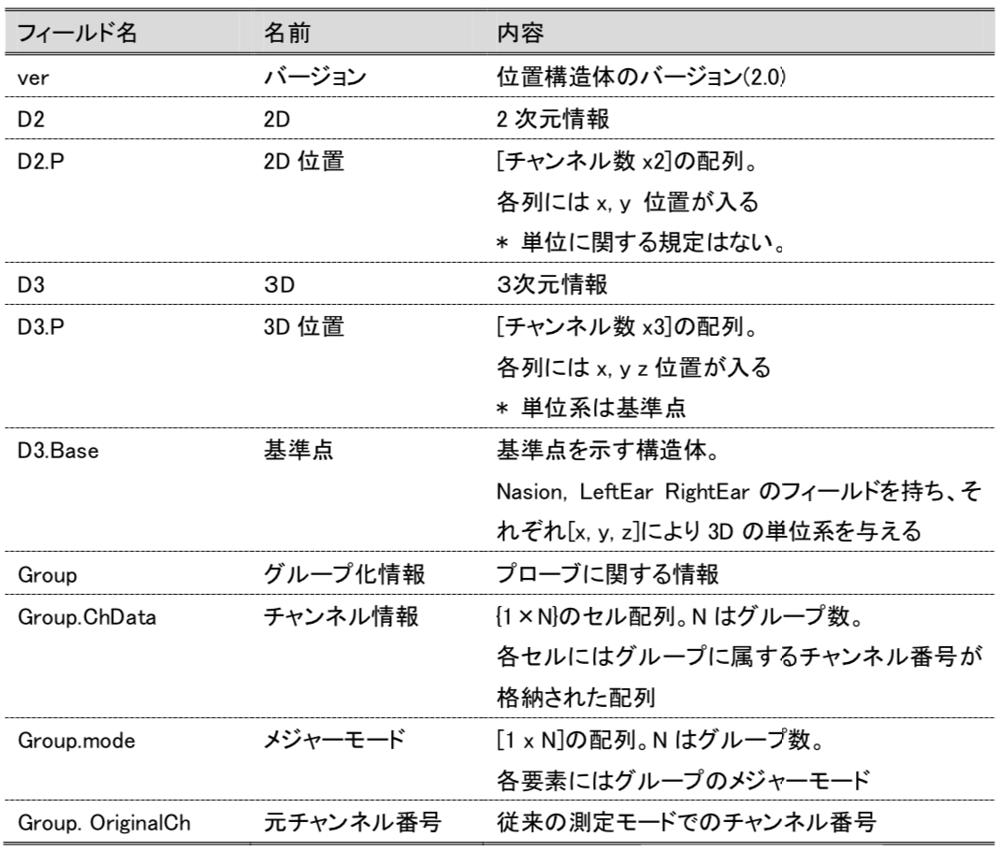

また、グループとは例えば下図のように、複数のプローブ配置で計測された実験データを1つのファイルにまとめるときに使われます。トポグラフィマップを作成するときなどデータを補間する際には、適切にグループを設定しなければなりません。Pos内のチャンネル番号は1から始まる通し番号になるように再計算されます。このとき、装置の出力でで付与されていたされていたチャンネル番号はOriginalChとして保存されます。


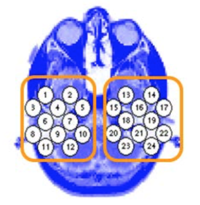


## 区間データのフォーマット

区間データのデータ部分は「区間番号」 ×「時系列」×「チャンネル」×「データの種類」の4次元データです。

ヘッダ部分は具体的には以下のフィールドを持つ構造体になります。時間や刺激データ、フラグデータが含まれますが、連続データとは内容が異なるものがあります。基本的には連続データと同じ構造で、相違点は赤文字で示して います。


区間データでは各々の区間で同様な刺激をしていることを前提にしています。その為、刺激情報(stim)や刺激の種類(stimTC)はブロック毎ではなく区間データに1つの値 になっています。この情報では足りないような解析を行う場合は stimTC2 を用います。

