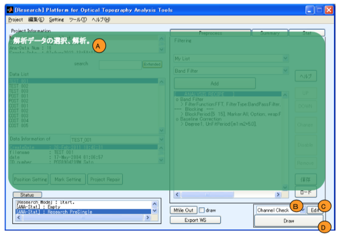
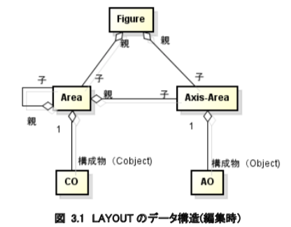
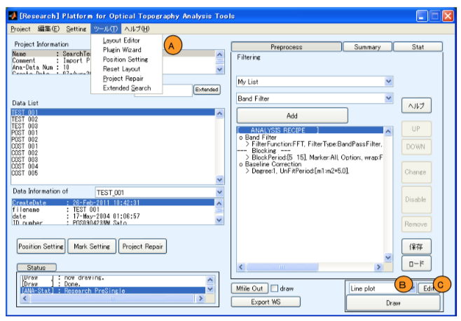
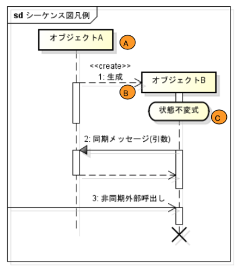
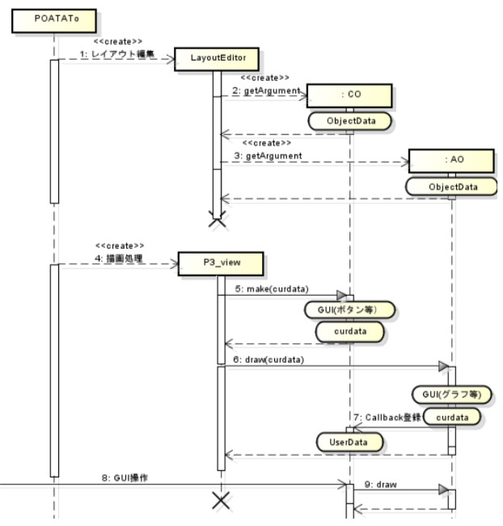

# Layout エディタ 操作マニュアル

*このドキュメントは校正が済んでいません。貢献頂ける方を歓迎します!*

[Open PoTAToドキュメントリストへ](index.md)


# 概要
## Open PoTAToにおける表示機能

本書はOpen PoTAToにおける表示について説明します。
Open Open PoTAToでは以下のような表示機能を備えています。

- 様々な表示方法を選択可能
- 表示された図をインタラクティブに変更可能
- 表示方法を変更可能
- 表示する内容を拡張可能

## 表示処理
Open PoTAToでは表示内容が記述されたLAYOUTファイルに基づきデータを描画します。このLAYOUTファイルはOpen PoTAToの補助ツールの一つであるLayout Editorを用いて作成，編集します。

Open PoTAToは作成されたLAYOUTとOpen PoTAToデータを用いて表示を実行します。ここでOpen PoTATo
データとはOpen PoTAToの解析結果として得られる連続データや区間データおよび要約統計量です。

Open PoTAToにおける表示処理は以下の流れになります。


## 説明内容

以下、2章でOpen PoTAToの表示機能として、操作方法とLAYOUTで出来ることを説明します。次に3章でLAYOUTの編集方法を説明します。編集に必要な知識として、LAYOUTの構成要素や変数(curdata)のスコープについても説明します。
最後に4章でLAYOUTの拡張方法を説明します。ここではFigureの制御を行うCOや、実際のデータの描画を行うAOの作成方法について説明します。


# Open PoTAToの表示機能

## Open PoTAToと表示処理

Open PoTAToメイン画面と表示処理の対応を示します。



解析領域(A)で、表示する解析データを選択し、解析方法の編集を行います。解析方法は目的により異なります。

表示方法としてLAYOUTをポップアップメニュー(B)から選びます。選択中のLAYOUTを編集したい場合はEditボタン(C)を押します。

最後にDrawボタン(D)を実施すると、(A)で指定した解析に従いOpen PoTAToデータが作成され、(B)のLAYOUTに従い描画処理が実行されます。


## 特徴

Open PoTAToではデフォルトで数十個のLAYOUTを用意しています。また、描画した図に対してチャンネルやデータの種類等を変更するための制御するものがあります。


この時、制御には影響範囲があります。

例えば上図の描画結果と制御の範囲を考えます。図中のデータの種類を制御するリストボックス(A)は(D1)および(D1)を書き換えます。また、チャンネル番号を制御するポップアップメニュー(B)は(D1)のみ書き換え、ポップアップメニュー(C)は(D２)のみ書き換えます。

LAYOUTは3章で説明するLayout Editorを使い、追加・編集可能です。また、図の制御や表示物を追加し、機能を拡張することが出来ます。

これらの特徴を可能にするため、Layoutは様々な構成物の組み合わせで示されます。構成物を組み合わせることにより、様々なLayoutが作成でき、編集可能になります。

Layout構成物には、制御する影響範囲を示す描画領域(Area)が存在します。Areaは親子関係を持ち、親が変更されると子も影響を受けます。例えば図2.2の場合、(B),、(C),が属するAreaは(A),が属するAreaの子になります。

また、構成物の制御を行う（CO）や描画を行う(AO)が存在します。これらは追加することが可能です。


# Layout Editorの使い方

## LAYOUTの構成要素

最初に編集する対象となるLayoutの構造を示します。

LayoutはFigure, Area、Axis-Areaおよび,CO、AOの5つの構成要素からなります。

FigureはMATLABのfigureのプロパティを書き換えます。FigureにはAreaやAxis-Areaを含みます。

Areaは表示物を記載する領域で、描画の実態は持ちません。制御を行うためのLayout構成物COや、AreaやAxis-Areaを含みます。Axis-AreaはMATLAB,のaxesを描画します。またAxes内に描画するためのLayout構成物、AOを含みます。

COはMATLABのuicontrolやuimenuなどを描画します。これらのGUIにより、描画した図に対してチャンネルやデータの種類等を変更します。COには設定・描画・制御のための処理が含まれます。
AOはAxis内にLineやImageを描画します。AOはこれらの設定・描画・再描画のための処理が含まれます。

## LAYOUTの構造とデータの引継ぎ

LAYOUTはFigureをルートとし、Area, Axis-Areaをリーフとする木構造で出来ています。具体的にFigure,Aｒｅａ、Axis-AreaのLAYOUTの構成要素は親子関係をもち、1つの親に対して0個以上の子が存在します。最初の親はFigureで、子どもにはArea/Axis-Areaを持つことができます。AreaはArea自身およびAxis-Areaを子に持つことができ、Axis-Areaは子を持ちません。

また、Areaは構成物としてCOを、Axis-Areaは構成物としてAOを持ちます。この関係をクラス図で表すと以下のようになります。



これらの親子関係は描画実施時のデータの引継ぎ方法に深く関係します。描画時を考えると、描画するチャンネルやデータの種類、線の色など、描画のための様々なデータがあります。これらのデータはcurdata(current-data)構造体にまとめて保存・管理されます。curdataは全ての構成要素が持っており、親から子へ引き継がれます。また子や兄弟から変更されません。

COは所属するAreaのcurdataに従って初期設定されます。ただしCOにcurdataの初期値が設定されている場合、そのAreaのcurdataを書き換えます。

AOは所属するAreaのcurdataに従って描画されます。先祖にCOが居る場合、描画後、COのCallbackによりcurdataは書き換えられることがあります。

データの影響範囲について、図3.2Layoutのオブジェクト図を例に説明します。


例にあるLayoutを描画するとき、layout:Figureでcurdataが作成されます。layoutの子、a1,a2には同じcurdataが渡ります。

a1ではチャンネル設定を行うcoが存在し、curdataのチャンネル値を変更します。この時、a2のcurdataは変更されませんが、その子、a11,a12,a13には変更されたチャンネル値が引き継がれます。

a11にはkindを設定するCOが存在し、curdataのkindを変更します。この結果はイメージ図:AOに引き継がれます。
描画完了後、a1に属するチャンネルCOにより再描画が実施される場合、a1の子孫であるイメージ図、周波数表示、ライン表示、刺激表示が再描画されます。

イメージ図を再描画する際、イメージ図が持つcurdataのうち、チャンネル値のみが更新されイメージが再描画されます。

a12に属するkind設定COにより再描画される場合は、イメージ図のみが再描画されます。この時、イメージ図が持つcurdataのうちkindのみが更新されイメージが再描画されます。


## Layout Editor概要

### 概要
Layout Editorは2つの画面を用いてLayoutを編集します。最初の画面はLayout Editorメイン画面です。ここで基本的なレイアウトの編集を行います。


もうひとつの画面はLayoutOverview画面です。ここではメイン画面だけではイメージしにくい概略図の確認を行います。また、配置の調整を行うことも可能です。


### 起動

Layout Editorの起動方法を説明します。



新にLayoutを作成する場合やLayoutファイルを手動で選択する場合、メニューからLayout Editorを起動します。この時、Open PoTAToメインウィンドウのツールメニューからLayout Editor(A)を選択してください。

Open PoTAToで管理しているLayoutを編集する場合、LayoutEditボタン(C)を押下します。そうするとLAYOUTポップアップメニュー(B)で選択されているLayoutを編集します。


### ファイルI/O

LayoutEditorが起動するとメイン画面にはFileメニューが存在します。Fileメニューは、LAYOUTファイルの操作として、New・Open等の基本的な処理を提供します。Fileメニューの一覧を下表に示します。

|ファイルメニュー| 内容|
| ------------- | -------------------- |
|New| 新規にLAYOUTを作成する|
|Open| 既存LAYOUTのオープン|
|Save| 編集LAYOUTの保存|
|SaveAs| 編集LAYOUTを別名で保存|
|Close| LAYOUTのクローズ|


### テスト表示
作成したLAYOUTの表示結果を手早くみたい場合はメイン画面にあるTestDrawメニューを選択します。そうするとこのLAYOUTを用いてサンプルデータの表示が行われます。

なお、サンプルデータは小さなデータで多くの情報が欠落しています。そのため、一部のAOでは期待した値が表示されないことがあります。サンプルデータを変更したい場合は

LayoutEdit\TestData\data0.mat

を変更してください。


## LAYOUTツリー

### LAYOUTツリーの表示
LayoutはFigure, Area, Axis-Areaおよび,CO、AOの5つの構成要素からなります。また、LAYOUTはFigureをルートとし、Area,Axis-Areaをリーフとする木構造で出来ています。


これをテキストで表現したものが、Layoutツリーリストボックス(A)に示されています。

Figureは先頭に１つのみ存在し、Layout名を表示しています。右図では”Lineplot”がLayout名です。Figureの子であるAreaやAxis-Areaはひとつ下の階層で示されます。

Areaは[+]、[-]または[]で始まる文字列で示されます。図では”[-]CallbackTime&Image”や”[-]ChannelGroupC8”等がAreaです。

Areaを構成するCOは”*”で始まる文字列で示されます。

図では”*StimAreaMenu”等がCOです。

Axis-Areaは{+}、{-}または{}で始まる文字列で示されます。図では”{-}setting”等がAxis-Area
です。
Axis-Areaを構成するAOは”>”で始まる文字列で示されます。図では”>Script”等がAOです。

AreaやAxis-Areaはダブルクリックすることによって展開、もしくは折りたたむことができます。Areaの場合、展開表示されている場合は“[-]“、折りたたまれている場合は”[+]”と表示され、子がない場合は”[]”と表示されます。


### ツリー操作
LAYOUTツリーは操作ボタン(A)もしくは、リストボックスを右クリックした際に開くコンテキストメニュー(B)を実行することで以下の操作が可能です。


カットボタン、もしくは切り取りメニューにより選択中の構成要素をカットできます。選択した構成要素に付随する構成要素（子やCO,AOなど）があれば併せてカットされます。

コピーボタン、もしくはコピーメニューにより選択中の構成要素をコピーできます。選択した構成要素に付随する構成要素（子やCO,AOなど）があれば併せてコピーされます。

ペーストボタンもしくは貼り付けメニューによりコピーもしくはカットにて保存されたデータを貼り付けます。
削除ボタン、もしくはDeleteメニューにより選択中の構成要素を削除できます。選択した構成要素に付随する構成要素（子やCO,AOなど）があれば併せて削除されます。

UPボタンもしくはUPメニューにより選択中の構成要素を上に移動します。移動は同一エリア内に限りますので、他のエリアへ移動する場合はカット＆ペーストを利用ください。DownボタンもしくはDownメニューにより選択中の構成要素を下に移動します。移動は同一エリア内に限りますので、他のエリアへ移動する場合はカット＆ペーストを利用くだ
さい。

## LAYOUT Overview

LAYOUT Overviewは描画後のFigureの確認のため、概略図を示します。また構成物の位置の変更を行います。
選択中の構成要素は赤い線で示されます。

選択中の構成要素の親となるAreaが青い点線で示され、内部は薄い青色で塗られます。ただし、親がFigureの場合は白色になります。

親Area内のCOは緑色の点線で示され、内部は薄い緑色で示されます。

親Area内のArea、Axis-Areaは青い点線で示されます。またAOはAxis-Area内部をベージュ色にすることで示されます。

サンプルを図で示します


選択中の構成物は枠をドラッグすることにより移動できます。また、右隅をドラッグすることでサイズを変更できます。


## Figureの設定

Layoutの先頭には必ずFigureが入ります。Figureは子としてAreaおよびAxis-Areaを持てます。
FigureではLAYOUT名、Figureのサイズ、色を設定できます。
Name(A)はレイアウト選択ポップアップメニューのレイアウト名として使われます。また、Figure
のNameプロパティに設定されます。
Position(B)はFigureの位置を示します。位置の単位系は’Normalized’で、左、下、幅、高さの４つのデータで設定します。
Color(C)はFigureの背景色になります。値の設定にはuisetcolor関数が参考になります。
Figureの子の追加はポップアップメニュー(D)からAreaもしくはAxis-Areaを選択し,Addボタン(E)を押してください。


## Areaの設定

AｒｅａはFigureもしくはAreaの子として作成され、子としてAreaおよびAxis-Areaを持てます。また構成物としてCOを持てます。
これらを追加するにはポップアップメニュー(A)からarea,axis,specialcontrolを選択し、Addボタン(B)を押してください。なお、specialcontrolは一部のCOを除くCOです。
Areaの設定にはPrimary,Variables,Othersの３つの設定があります。
PrimaryはAreaの配置や位置を設定します。
またVariableでは良く使われるCOとして、データの選択、チャンネルの選択、データの種類の選択に関するCOの設定を行います。
Othersではその他のcurdataの変更を行います。


### AreaのPrimary設定

AreaのPrimary設定ではAreaの基本的な設定を行います。

最初に配置方法リストボックス(A)で通常の”SimpleArea”か”ChannelOrderArea”を選びます。SimpleAreaは通常のAreaで、”ChannelOrderArea”はAreaの子の部分をチャンネル数分コピーし、作成・配置します。

このとき配置方法をリストボックス(B)から選びます。配置方法は通常“Normal”を選びますが、”Array(Square)”により配列のように並べることも可能です。

またAreaの名前をName(C)に指定します。位置は親からみた相対位置(D)もしくはFigure上での絶
対位置(E)を”normalized”単位で指定します。

またArea内の以降の線に関するプロパティ設定を行いたい場合はLinePropertyチェックボックス(F)を有効にします。なお、LinePropertyはcurdataとして渡されるため、上書きされる場合があります。


### AreaのVariables設定
Variableでは良く使われるCOとして、データの選択、チャンネルの選択、データの種類の選択に関するCOの設定を行います。

最初にAreaのVariableトグルボタンを押下状態にします。

Variable設定では各行にCOの種類が、列に設定値が表示されます。

COの種類は左の文字列(A)に記載されています。文字列の右側にあるチェックボックス(B)でCOの有効/無効を設定します。

有効にしたあと、GUIの表示スタイル(C)を選択します。デフォルトは”None”です。”None”の場合はCOを作成せず、描画時にcurdataを変更します。

“None”以外のスタイルが設定されると、COが有効になり、LAYOUTツリーに追加されます。また、位置を持つスタイルが選択されると相対位置の入力ボックス(D)が表示されますので、所属するArea内での相対位置を記載します。最後に初期値をSetボタン(E)で設定します。


### AreaのOthers設定
AreaのOthersトグルボタンを押下状態にするとスクリプトの設定画面が開きます。ここでは、スクリプトを実行することにより、詳細な設定を行います。スクリプトで利用/変更できる変数はcurdata構造体です。curdata構造体のフィールドは任意に追加できますが、主要なフィールドは以下の通りです。

| フィールド名 | 内容 | 例 |
| ------ | ------ | ---- |
| region | 解析データの種類<br>(Continuous/Block/Summary) | ‘Continuous’ |
| cidmax | 連続データの数 | 1 |
| bidmax | ブロック数 | 2 |
| time | 時刻範囲 | [-Inf Inf] |
| ch | チャンネル番号 | 1 |
| kind | データの種類  | [1 2] |
| gcf | 描画中のfigureハンドル | 2 |
| menu_current | メニューハンドル | 10.01 |
| path | Curdata 所有構成物の<br>LAYOUT内の構成要素位置 | [1 2 2] |
| LineProperty | 線のプロパティ <(通常 GUI で設定)> | - |
| CommonCallback-Data | 共通CO参照用データ | - |


次のようなレイアウトを例にスクリプト作成例を示します。


Area,A1のスクリプトに”curdata.foovar=10”と記述します。

このとき、A1の子孫であるAA11とそのScript、AA12とそのScriptにcurdata.foovarの値が引き継がれます。

またA1の子ではないA2ではcurdata.foovarは存在しません。


## CO: Control-Object

COはAreaの構成物として作成され、子を持ちません。
COをLayoutツリーで選択すると編集画面が表示されます。
編集画面では、COの位置と固有のパラメータを設定します。
位置は親からみた相対位置(A)もしくはFigure上での絶対位置(B)を”normalized”単位で指定します。
設定したCO固有パラメータはリストボックス(C)に表示さますが、変更したい場合はModifyボタン(D)を押します。


## Axis-Areaの設定

Axis-AreaはFigureもしくはAreaの子として作成されます。子は持ちませんが、構成物としてAOを持ちます。

Axis－Areaの設定は名称と位置のみです。
Axis-Areaの名称はエディットテキスト(A)に記入します。位置は親からみた相対位置(B)もしくはFigure上での絶
対位置(C)を”normalized”単位で指定します。


Axis内にAOを追加するには、画面左下のAOポップアップメニュー(A)からAOを選択し、Addボタン(B)を押してください。


## AO:Axis-Object設定

AOはAreaの構成物として作成され、子を持ちません.
AOをLayoutツリーで選択すると編集画面が表示されます。
編集画面では、AOの固有のパラメータを設定します。設定済みのAO固有パラメータがリストボックス(A)に表
示さます。この値を、変更したい場合、Modifyボタン(B)を押します。


# 表示機能拡張

## 説明内容

LAYOUTの構成要素であるAO,COを新たに作成することにより、Open PoTAToの表示機能を拡張する方法を説明します。ここではプログラムコードの作成を前提としていますので、プログラムサイドからの説明になります。

作成のための予備知識として、Open PoTAToにおける表示処理について説明します。ここで、3.2LAYOUTの構造とデータの引継ぎに関しては再度説明しません。

ここでは典型的なAO,COについて説明します。一部のAO,COの動作と異なる場合があります。


## 表示機能とLAYOUT
表示処理において、LAYOUTの構成物のCO,AOの相互作用に注目して説明します。ここで相互作用の説明にはUMLにおけるシーケンス図を用います。
最初に簡単に今回の表記で用いているシーケンス図について説明します。
シーケンス図の例を右図に記載します。図の縦軸は時間で、上から下に流れます。
また考慮するオブジェクト(A)を四角と点線で示しています。点線は存在する期間を示しており、削除される時点を×で示します。ここで言うオブジェクトは各種ウィンドウやCOやCOです。CO、AOはMATLAB上では単なる特定の構造を持つデータで、そのひとつひとつをオブジェクトと言います。オブジェクトは、特定の関数（およびそのサブ関数）を用いて操作します。
図ではこれら操作をメッセージ(B)として記載します。特に注目している引数がある場合のみ括弧内に引数を記載しています。メッセージを受け、オブジェクト内部に正しく初期化されたデータを持つようになった時、状態不変式(C)にそのデータを示しています。




描画時のCO,AOの主要なシーケンスを示します。




描画する際、Open PoTAToからみると3つの状態があります。１つはLayout EditorでLayoutを作成している状態、もうひとつはP3_view関数で描画を実行している状態、そして最後は描画後、コントロールにより図の再描画等を行っている状態です。

最初に、Open PoTAToにより1.LayoutEditorが起動され、Layoutの作成状態になります。

LayoutEditorからCOの2.getArgumentサブ関数が呼び出されCOが生成されます。このときCOはObjectDataとして作成されLayoutに保存されます。

同様にLayoutEditorからAOの3.getArgumentサブ関数が呼び出されAOが生成されます。ここで実際の編集作業ではCO,AOの生成順序、生成数に制限はありません。また、削除や変更などのメッセージは省略しています。

Layoutが作成されると、Open PoTAToにより4描画処理が実行されます。この時、P3_Viewにより処理が行われます。描画処理中、LAYOUT構成要素であるArea,Axis-Areaはそれぞれ自分のcurdataを保持し、curdataを利用・変更し、親から子へcurdataを引き継いでいきます。

CO描画時、描画処理(P3_View)はCOに対してCOの属するAreaのcurdataを引数とし5.makeを実施します。この時COはボタン等のGUIを作成し、curdataを内部に保持します。また、上位Areaのcurdataを更新します。
AO描画時、描画処理(P3_View)はAＯに対してAOの属するAxis-Areaのcurdataを引数とし6.drawを実施します。この時、AOはグラフを描画などによりGUIを作成し、curdataを保持します。また、先祖にCallbackを受けたいCOが居る場合、そのCOに7.Callbackしてもらうようデータを登録します。登録されたデータはCO内にUserDataとして保存されます。
最後にCOが作成したGUIがユーザ等により8操作された際、COは登録されているAOの持つcurdataを書き換え9.draw関数を実行します。
なお、ここでの説明はCO,AOの相互作用を主眼にしたため、Open PoTATo内部で行う描画管理処理に関しては大幅に省略しています。省略しているものはArea,Axis-Areaに関する処理や、CO,AOの基本情報の参照メソッドcreateBasicInfoや、描画処理を行うための処理をdrawstrメソッドです。また、ObjectDataやcurdata引継ぎ、保存方法に関しても省略しています。

## データ構造

CO,AOを拡張する上で必要なデータ構造を説明します。LAYOUTの構造とcurdataに関しては[LAYOUTの構造とデータの引継ぎ](LAYOUTの構造とデータの引継ぎ)も参照ください。
なおデータ構造は、LAYOUT編集中、描画中、GUIによるCallback中の３つの状態の影響を受けます。

### Open PoTAToデータ
描画中のOpen PoTAToの解析結果として渡された、連続データや区間データおよび要約統計量は、
FigureのApplicationDataとして保存されます。なお、存在しないデータは空([])になります。

|データ名|内容|関連curdata|
| ----- | ----- | ----- |
| CHDATA | 連続データ(ヘッダ) | curdata.region=’Cntinuous’  |
| CDATA | 連続データ | curdata.cid0 |
| BHDATA | 区間データ(ヘッダ) | curdata.region=’Block’ |
| BDATA | 区間データ | curdata.stimkind<br>curdata.flag.MarkAveraging |
| SSHDATA | 要約統計量(ヘッダ) | curdata.region=’Summary’ |
| SSDATA | 統計量(ヘッダ) | - |


現在、注目している描画対象のデータはcurdataにより記載されます。データの種類はcurdataの.regionで指定されます。
また、連続データが複数ある場合、cid0に連続データの通し番号が、区間データの場合は
stimkindに注目中の刺激の種類が指定されます。
データの取得にはp3_LayoutViewToolの’getCurrentData’が利用できます。


### ObjectData
ObjectDataはAO, COが持つサブ関数getArgumentにより作成されるデータで、利用関数名や引数などが格納されます。
AOのObjectDataはLAYOUT編集中にgetArgumentにより作成されLAYOUT内のAxisAreaの構成要素(Object)に保存されます。
描画中、AxisArea内ではobj{idx}として参照可能です。通常、AOのサブ関数drawstrを通して参照され、AOのサブ関数drawの引数objdataとして渡ってきます。また、draw中に描画中のAOに対応するApplicationDataとして保存されます。
GUIによるCallback中、ObjectDataはCO内でApplicationDataから呼び出され、AOのサブ関数drawに渡されます。
なお、ApplicationDataとのI/Oはp3_ViewCommonCallback関数が利用できます。AO:描画処理終了時に、”checkin”で保存し、COは”getData”で呼び出します。また、AO再描画時は”update”を用いてデータを更新します。詳細は補助関数を参考ください。
ObjectDataの例を示します。なおAOのサブ関数getArgument関数に依存します。


|フィールド名|内容|例|
| ----- | ----- | ----- |
| str | 表示名  | ‘3D_BrainSurf’  |
| fnc | AO 関数名  | ‘LAYOUT_AO_3DBrainSurf' |
| ver | Version:内部管理用 | 1 |
| (Arg1) | 引数など  | 4 |


COのObjectDataはLAYOUT編集中にgetArgumentにより作成され、LAYOUT内のAreaの構成要素(CObject)として保存されます。

描画中、Area内でcbobj{idx}として参照可能です。通常、COのサブ関数drawstrを通して参照され、AOのサブ関数makeの引数objとして渡ってきます。objデータは通常make後に破棄されますが、COによっては作成uicontrol内の’UserData’に保存されることがあります。

GUIによるCallback中、ObjectDataは通常利用しません。

ObjectDataの例を示します。なおCOのサブ関数getArgument関数に依存します。


### AO: Draw処理と関連データ

AOのサブ関数drawを実施する上で必要なその他のデータについて説明します。関連するハンドルとして、AOを描画するAxesハンドルが入力として渡ってきます。また、Drawにより作成されたハンドル群を出力します。ハンドル群は再描画前に削除するために利用されます。また、AOはObjectIDを持ちます。AOのDraw処理に必要な情報の多くはApplicationDataとして保存しますが、このデータを取得する際に利用します。なお、ObjectIDは通常p3_ViewCommonCallback関数を用いて発行します。
### CO: Callback処理と関連データ
一般的なCOがGUIよりコールバックされた時に必要なデータについて説明します。
GUIからコールされた時の引数は対象GUIのハンドルです。実行に必要なデータはそのハンドル内のUserDataプロパティに格納されています。
UserDataはセル配列で定義されており、Callback登録されているAOの一覧が入っています。ただし、描画時にObjectDataを保存している場合、UserDataが1番目のセルに格納されている場合があります。
COのUserData内にCallback登録されているデータの変数名は多くの場合udと表現されています。udは以下のデータを持ちます。

|フィールド名|内容|例|
| ----- | ----- | ----- |
|axes|対象 Axes のハンドル|347.0016|
|ObjectID|AO の ObjectID|1|
|name|AO の名称|‘Layout_AO_TimeLine_ObjectData’|
|str|Callback するための文字列|‘Layout_AO_TimeLine_ObjectData(‘’draw’’, ...|


このudを用いるとApplicationDataに保存しているAOのDraw処理に関する情報（AO関連データ）が取得できます。取得は以下の様に補助関数p3_ViewCommonCallbackを利用します。

data=p3_ViewCommonCallback(‘getData’,ud.axes,ud.name,ud.ObjectID);
関数を実行するとud.axesをカレントAxesに変更し、Application-Dataからname,ObjectIDに対応したdataを取り出します。ここでdataの構造は以下のようになっています。

| フィールド名 | 内容                  | 主な用途         |
| ------------ | --------------------- | ---------------- |
| handles      | AO が作成したハンドル | 描画前に削除する |
| axes         | AO の属する Axes      | 描画(ud.str)     |
| curdata      | AO 内部の curdata     | 更新および描画   |
| obj          | AO の ObjectData      | 描画             |


handles AOが作成したハンドル 描画前に削除するaxes AOの属するAxes 描画（ud.str）curdata AO内部のcurdata 更新および描画obj AOのObjectData 描画

## 補助関数

AO, COを作成中に利用する補助関数を説明します。

| 関数名              | サブ関数名                   | 内容                                                         |
| ------------------- | ---------------------------- | ------------------------------------------------------------ |
| p3_LayoutViewerTool | getCurrentData               | 描画対象の POTATo データを取得する                           |
| p3_ViewCommonCallck | checkin<br>update<br>getdata | AO 関連データを保存し、Common CO に登録する<br>AO 関連データを更新する<br>AO 関連データを取得する |


### Open PoTAToデータの取得
curdataに対応するOpen PoTAToデータの取得のためには以下の関数を利用します。

| 項目              | 説明                   |
| ------------------- | ------------------- |
|シンタックス| [hdata, data] = p3_LayoutViewerTool(‘getCurrentData’, fh, curdata);|
|機能| 描画中の curdata に対応する POTATo データを取得する。|
|入力| **fh** Figure ハンドル(描画中のもの)|
|　|**curdata** curdata|
|出力| **hdata** POTATo データ(ヘッダ)|
|　|**data** POTATo データ|

関数はcurdata.regionをみて、対象となるOpen PoTAToデータを取得します。regionが”Block”の場合は通常、curdata.flag.MarkAveraging=falseの時を除きdataはグランドアベレージ後のdataになり3次元になります。また、対象データが無いときは空行列が帰ってきます。

ApplicationDataから直接Open PoTAToデータを取得する場合やその他の関連するcurdataに関してはOpen PoTAToデータ](Open PoTAToデータ)をご参照ください。


### AO関連データのI/O
AO関連データを保存し、Common-COにCallback登録するには以下の関数を使います。


| 項目         | 説明                                                         |
| ------------ | ------------------------------------------------------------ |
| シンタックス | ID= p3_ ViewCommonCallck (‘checkin’,h,name, ah, curdata, obj); |
| 機能         | AO 関連データを保存し、Common-CO に Callback 登録する        |
| 入力         | **h** AO が作成したハンドルの配列(再描画時に書き換えるもののみ)  |
|              | **name** Application Data に登録する名前(AO 固有の名前であること) |
|              | **ah** AO の親となる axes                                        |
|              | **curdata** curdata                                              |
|              | **obj** AO の ObjectData                                         |
| 出力         | **ID** AO の ObjectID                                            |


checkinされたデータはAO関連データ(表4.5 CO:AO関連データ（data）)に変更されます。このAO関連データはAO固有の名前”name”のApplicationデータ内にあるセル配列の末尾に追加されます。

このとき、セル配列を参照するための番号がObjectIDとして返されます。

checkinされたAO関連データを更新します。

| 項目         | 説明                                                         |
| ------------ | ------------------------------------------------------------ |
| シンタックス | p3_ViewCommonCallck(‘update’,h,name, ah, curdata, obj,ID);   |
| 機能         | 指定した name, ID に対応する AO 関連データを更新する         |
| 入力         | **h** AO が作成したハンドルの配列(再描画時に書き換えるもののみ)  |
|              | **name** Application Data に登録する名前(AO 固有の名前であること) |
|              | **ah** AO の親となる axes                                        |
|              | **curdata** curdata                                              |
|              | **obj** AO の ObjectData                                         |
|              | **ID** AO の ObjectID                                            |


保存したAO関連データを呼び出すには以下の関数を使います。

| 項目         | 説明                                                         |
| ------------ | ------------------------------------------------------------ |
| シンタックス | p3_ViewCommonCallck(‘update’,h,name, ah, curdata, obj,ID);   |
| 機能         | AO 関連データを保存し、Common-CO に Callback 登録する        |
| 入力         | **ah** AO の親となる axes                                    |
|              | **name** Application Data に登録する名前(AO 固有の名前であること) |
|              | **ID** AO の ObjectID                                        |
| 出力         | **data** AO 関連データ                                       |

通常COから呼び出されますが、実行に必要なデータはUserData(表4.4 CO:Callback登録データ（UserData内）)に保存されています。


## AO:Axis-Objectの作成
### AO関数インタフェィス
AOの処理はOpen PoTATo内のLAYOUT/AxisObjecｔフォルダ内に作成されたLAYOUT_AO_*.mに記述します。この関数は以下のようなインタフェィスを持ちます。
LAYOUT_AO_*(‘subfncname’,[arg1,arg2,・・・])
ここでsubfncnameにサブ関数名が入り、arg1,arg2・・・はサブ関数の引数です。用意すべきサブ関数は以下になります。

| サブ関数名      | 内容                       |
| --------------- | -------------------------- |
| createBasicInfo | 基本情報設定               |
| getArgument     | ObjectDataを設定する       |
| drawstr         | 描画時の実行方法を提供する |
| (draw)          | 描画処理                   |

それぞれのサブ関数の引数や用途は決まっており、ここでは各サブ関数について説明します。なお、これらの関数の骨格となるコードは、他のAOをコピーするか、”P3_wizard_plugin“のViewerAxis-Objectにて作成できます。

### createBasicInfo
編集時や描画中の基本情報を設定します。

| 項目         | 説明                                            |
| ------------ | ----------------------------------------------- |
| シンタックス | info=createBasicInfo                            |
| 機能         | 指定したname,IDに対応するAO関連データを更新する |
| 出力         | **info** 基本情報（構造体）                     |


ccbはp3_ViewCommonCallck/checkinでCommon-COに対してCallback登録を実施するかどうかの判定をするさいに使います。ccbが‘all’の場合は全てCallback登録します。

‘all’設定は容易ですが、描画に時間のかかるAOは不必要なタイミングで再描画されないよう、COを限定すべきです。

| フィールド名 | 内容                              | 例                              |
| ------------ | --------------------------------- | ------------------------------- |
| MODENAME     | AOの名前                          | '2DImage(2.0)';                 |
| fnc          | AOの関数名                        | mfilename                       |
| ver          | バージョン                        | 2.0                             |
| ccb          | Callback登録するCommon-COのリスト | {'Data','DataKind','stimkind'}; |


### getArgument
描画処理を実施するための引数設定を行います。

| 項目         | 説明                                                         |
| ------------ | ------------------------------------------------------------ |
| シンタックス | obj=getArgument(obj)                                         |
| 機能         | AO: 描画のための引数を設定する                               |
| 入出力       | **obj** AOのObjectData ([ObjectData](ObjectData)の表AO:ObjectDataを参照) |

Layout Editorから呼び出されます。
新規作成時、objは空白になり、更新時、objは以前のobjが設定されます。キャンセルする場合はreturn前にobj=[]；と設定します。


### drawstr,draw

描画処理を実施するための文字列を渡します。文字列はAxis-Area内のAO描画処理で実行されますので、変数のスコープには注意が必要です。

| 項目         | 説明                                              |
| ------------ | ------------------------------------------------- |
| シンタックス | str=drawstr(varargin)                             |
| 機能         | AO：描画処理のための文字列作成                    |
| 入力         | **varargin**  varargin{1}にはObjectDataが入ります |
| 出力         | **str** Axis-Area内のAO描画処理で実行する文字列   |


通常、以下のように記載します。

```matlab
function str = drawstr(varargin) %#ok
str=[mfilename, ' (''draw'', h.axes, curdata, obj{idx})'];
```

上記の記載を前提にdraw処理を説明します。

| 項目         | 説明                                     |
| ------------ | ---------------------------------------- |
| シンタックス | hout=draw(gca0,curdata,objdata,ObjectID) |
| 機能         | AO：描画処理                             |
|入力|**gca0** AOの親となるaxes|
|　|**curdata** curdata|
|　|**objdata** AOのObjectData|
|　|**ObjectID** AOのObjectID(ただし、再描画の時のみ)|
|出力|**hout** AOが作成したハンドルとタグを記載した構造体|

ここでhoutはhout.hにハンドルの配列、hout.tagにタグのセル配列を作成します。

ここでdraw処理の一般的な内容について説明します。
Open PoTAToデータを利用する場合は以下の一文を追加しOpen PoTAToデータを取得します。

```matlab
[hdata,data]=osp_LayoutViewerTool(... 'getCurrentData',curdata.gcf,curdata);
```

次に、グラフを描画します。例えば以下の様なコードになります。

```matlab
h.h = surf(peaks(10)); % ハンドルを設定します(必須)
h.tag = {‘test’}; % タグを設定します
```

実際にはこのグラフ描画がAOのコア部分です。

また、ApplicationDataI/OおよびCommonCOにCallbackを呼び出すよう登録します。


```matlab
%=====================================
%= Common-CO への Callback 登録 =
%=====================================
myName='LAYOUT_AO_hoge'; % Application Data に登録する名前
if exist('ObjectID','var'),
	% 再描画時
	p3_ViewCommCallback('Update', ...
      h.h, myName, ...
			gca0, curdata, obj, ObjectID);
	return; % Update して終了
else
% Application Data の登録、Callbak 登録
	ObjectID = p3_ViewCommCallback('CheckIn', ...
      h.h, myName, ...
			gca0, curdata, obj); % ObjectID 取得
end
```


最後に、CommonCO以外のCOにCallback登録します。以下はCallbackの必要がある場合のみ行います。なお、Callbackの登録の方法はCOにより異なりますが、典型的なCOは同じです。
最初に登録用データとしてUserData(表4.4CO:Callback登録データ（UserData内）)を作成しまう。
次に、curdata内にある対象のCOにUserDataを追記します。


```matlab

% ================================================================
% = Callbackの登録 =
% ================================================================
% Callback 登録用データの作成
udadd.axes = gca0;
udadd.ObjectID = ObjectID; % Common CO の登録で発行された ID
udadd.name = myName;       % Common CO の登録時と同じ
udadd.str = [objdata.fnc,...
    '(''draw'',data.axes, data.curdata, data.obj, ud.ObjectID);'];
%------------------------
% Callback 登録 ( XX)
%------------------------
% CO_XX が存在するかどうかのチェック
if isfield(curdata,'Callback_XX') && ...
        isfield(curdata.Callback_XX,'handles') && ...
        ishandle(curdata.Callback_XX.handles)
    % See also LAYOUT_CO_XX
    % ハンドル取得
    h = curdata.Callback_XX.handles;
    % UD の追加
    ud=get(h,'UserData'); % 現状の ud 取得
    if isempty(ud)
        ud = {udadd};
    else
        ud{end+1}=udadd;
    end
    set(h,'UserData',ud); % UD 更新
end

```


## CO:Control-Objectの作成

COの処理はOpen PoTATo内のLAYOUT/ControlObjectフォルダ内に作成されたLAYOUT_CO_*.m
もしくはLAYOUT_CCO_*.mに記述します。
ここで、COは通常のCO,CCOはCommon–COです。

この関数は以下のようなインタフェィスを持ちます。
LAYOUT_[C]CO_*(‘subfncname’,[arg1,arg2,・・・])

ここでsubfncnameにサブ関数名が入り、arg1,arg2・・・はサブ関数の引数です。用意すべきサブ関数は以下になります。

| サブ関数名      | 内容                   |
| --------------- | ---------------------- |
| createBasicInfo | 基本情報設定           |
| getArgument     | ObjectDataを設定する   |
| drawstr         | COの作成方法を提供する |
| (make)          | CO作成                 |
| (mycallback)    | Callback実行           |

サブ関数getDefaultCObjectはLayoutEditorのArea内Variable設定をする一部のCOには必須ですが、今回は説明しません。

以下、それぞれのサブ関数の引数や用途は決まっており、ここでは各サブ関数について説明します。
なお、これらの関数の骨格となるコードは、他のCOをコピーするか、以下のコードを利用ください。


```matlab
function varargout=LAYOUT_CO_XX (fcn,varargin)
% ヘルプを記載します
if nargin==0, fcn='help';end
%====================
% Switch by Function
%====================
switch fcn
    case {'help','Help','HELP'}
        POTATo_Help(mfilename);
    case {'createBasicInfo','drawstr','getArgument'}
        % Basic Information
        varargout{1} = feval(fcn, varargin{:});
    case 'make'
        varargout{1} = make(varargin{:});
    otherwise
        % Default
        if nargout
            [varargout{1:nargout}] = feval(fcn, varargin{:});
        else
            feval(fcn, varargin{:});
        end
end %===============================
return;
```


### createBasicInfo
編集時や描画中の基本情報を設定します。


| 項目         | 説明                                            |
| ------------ | ----------------------------------------------- |
| シンタックス | info=createBasicInfo                            |
| 機能         | 指定したname,IDに対応するCO関連データを更新する |
| 出力         | **info** 基本情報（構造体）                     |

ここで、基本情報構造体は以下のフォーマットです。


| フィールド名 | 内容       | 例                 |
| ------------ | ---------- | ------------------ |
| name         | COの名前   | 'XX';              |
| fnc          | COの関数名 | mfilename          |
| rver         | バージョン | ‘ Revision: 1.1’   |
| date         | 最終更新日 | ‘Date: 2012/09/01’ |

rver,dateは使用していませんが記載を推奨します。
uicontrolフィールドはLayoutEditorのArea内Variable設定をする一部のCOには必須ですが今回は説明しません。

### getArgument
描画処理を実施するための引数設定を行います。

| 項目         | 説明                                                         |
| ------------ | ------------------------------------------------------------ |
| シンタックス | obj=getArgument(obj)                                         |
| 機能         | CO：描画のための引数を設定する                               |
| 入出力       | **obj** COのObjectData([ObjectData](ObjectData)の表 COのObjectDataを参照) |

LayoutEditorから呼び出されます。

新規作成時、objは空白になり、更新時、objは以前のobjが設定されます。

キャンセルする場合はreturn前にobj=[]；と設定します。

### drawstr,make
CO描画処理を実施するための文字列を渡します。文字列はAxis-Area内のCO描画処理で実行されますので、変数のスコープには注意が必要です。

| 項目         | 説明                                              |
| ------------ | ------------------------------------------------- |
| シンタックス | str=drawstr(varargin)                             |
| 機能         | CO：描画処理のための文字列作成                    |
| 入力         | **varargin**  varargin{1}にはObjectDataが入ります |
| 出力         | **str** Axis-Area内のCO描画処理で実行する文字列   |


通常、以下のように記載します。

```matlab
function str = drawstr(varargin)
% Execute on ViewGroupCallback 'exe' Function
str=['curdata=’ mfilename ‘(''make'',handles, abspos,' ...
      'curdata, cbobj{idx});'];
return;
```


上記の記載を前提にmake処理を説明します。


| 項目         | 説明                                              |
| ------------ | ------------------------------------------------- |
| シンタックス | curdata=make(hs,apos,curdata,obj)                 |
| 機能         | CO：描画処理                                      |
| 入力         | **hs** 上位ハンドル                               |
|              | **abspos** 上位Areaの絶対位置（Normalized Units） |
|              | **curdata** curdata                               |
|              | **objdata** COのObjectData                        |
| 出力         | **curdata** curdata                               |

ここでmake処理の一般的な内容について説明します。

CommonCOの場合はCommonCO用の構造体の基本設定を行います。


```matlab
%=====================
% Common-Callback-Data
%=====================
CCD.Name         = 'XX';        % CO の名前
CCD.CurDataValue = {'XX','xx'}; % AO 基本情報 ccb の指定名
CCD.handle       = [];          % Callback 登録するハンドル
```

この例では、AOの基本情報(表4.8 AO:基本情報)内のccbに、’XX’もしくは‘ｘｘ’をもつAOに限りCallback登録するよう設定しています。（ただしcbbがallの場合はCallback登録します。


次にGUIを作成します。

```matlab
h0       = uicontrol;
```

実際にh0とハンドルを作る必要はないですが、これ以降便宜上h0として話しをします。

GUIの位置は相対位置で着ていますので以下のように変更が必要です。

```matlab
pos=getPosabs(obj.pos,apos);

function lpos=getPosabs(lpos,pos)
% Get Absolute position from local-Position 
lpos([1,3]) = lpos([1,3])*pos(3);
lpos([2,4]) = lpos([2,4])*pos(4);
lpos(1:2)   = lpos(1:2)+pos(1:2);
```


なお、単位はNormalizedですので位置設定を行う前にuicontrolなどのプロパティ’Units’を’Normalized’に設定する必要があります。

Callback設定は次のようにします。

```matlab
set(h0, 'Callback',....
    [mfilename ' (''mycallback'',gcbo)']);
```


ここではCallback関数をサブ関数のmycallbackと設定しています。サブ関数名は自由ですが、以降mycallbackと設定したものとします。

最後に、makeで作成したdataをcurdataに反映させます。デフォルト値などで値を変えた場合、

```matlab
curdata.foovar = obj.defaultfoovar; % この CO が foovar を変更
```

また、COの場合はハンドルを引き継ぎます。

```matlab
curdata.Callback_XX.handles =h0;
```

CommonCOの場合は次のようにハンドルを引き継ぎます。

```matlab
CCD.handle =h0;
if isfield(curdata,'CommonCallbackData')
curdata.CommonCallbackData{end+1}=CCD; else
curdata.CommonCallbackData={CCD}; end
```


### mycallback
上記のmake処理を前提にmycallback関数を説明します。

| 項目         | 説明                 |
| ------------ | -------------------- |
| シンタックス | mycallback(h)        |
| 機能         | COのコールバック処理 |
| 入力         | **h** COハンドル     |

ここでmycallback処理の一般的な内容について説明します。最初に再描画する際に変更す値を用意します。

```matlab
foovar = get(h,’Value’);
```


この例では、COはcurdata.foovarを変更するものとし、foovarはhの’Value’で指定されているものとします。

次にCallback登録されているAOについてループ処理を行い終了します。

```matlab
ud=get(h,'UserData');

for idx=1:length(ud), % for のループ変数名は必ず idx とします。 
    % <<< 以降はこの内部処理の説明になります>>
end
return;
```


ここで、udの内部は表4.4 CO:Callback登録データ（UserData内）に記載しています。

ループ内では最初にAO関連データ(表4.5 CO:AO関連データ（data）)を取得します。

```matlab
% Get Data
data = osp_ViewCommCallback('getData', ...
    ud{idx}.axes, ...
    ud{idx}.name, ud{idx}.ObjectID);
```

次に対象AOのcurdataを更新します。

```matlab
% curdata の更新
data.curdata.foovar =foovar;
```


なお、この場合foovarを更新しています。再描画の前に以前のAOが書いた図を削除します。

```matlab
% Delete handle
for idxh = 1:length(data.handle),
    try
        if ishandle(data.handle(idxh))
            delete(data.handle(idxh));
        end
    catch
        warning(lasterr);
    end % Try - Catch
end

```


最後に再描画を実行します。

```matlab
% Evaluate (Draw)
try
    eval(ud{idx}.str);
catch
    warning(lasterr);
end % Try - Catch
```


# 付録：ScriptAOの使用方法

## 概要

ここで、AOのひとつScriptAOの使用例を説明します。
ScriptAOはスクリプトにより比較的自由に描画を行うためのAOです。

AOは入力に２つのスクリプトを持ちます。
ひとつはAxisおよび同一Axis内にある後続のAOに影響を与えるcurdataを編集するためのスクリプトです。これをAxis用スクリプトと呼びます。このスクリプトは描画時に１度のみ実行されます。
もうひとつはdraw実施のスクリプトです。これを描画用スクリプトと呼びます。このスクリプトは描画時および再描画時に実行されます。

## 設定

ScriptAOをLayoutに追加するには他のAOと同じくLayoutEditor上で行います。
Layoutを作成し、Scriptを設定したいAxisAreaに移動し、AOポップアップメニューから”Script”を選択します。
そうするとScript設定画面が開かれます。


Script設定時、右図のようなダイアログが表示されます。ここで上のエディットボックス(A)にAxis用スクリプトを、下のエディットボックス(B)に描画用スクリプトを記述します。
内容がよければOK(C)ボタンを押して確定します。

以下、Axis用スクリプト、描画用スクリプトの詳細を説明します。


## Axis用スクリプト

Axis用スクリプトは、Axisおよび同一Axis内にある後続のAOに影響を与えるcurdataを編集するためのスクリプトです。このスクリプトは描画時に１度のみ実行されます。
また、AOは全てのCommon-COからCallbackされるため、１度きりで良い処理かつ時間の掛かる処理もAxis用スクリプトに入れます。
Axis用スクリプトはAxis-Areaの描画処理内で実行されます。
そのため変更は親Axisと後続するAOに影響を及ぼします。Axis内で利用できる主なデータは以下になります。

| フィールド名 | 内容                 |
| ------------ | -------------------- |
| h.axes       | Axesハンドル         |
| curdata      | Axis-Area内のcurdata |
| obj{idx}     | ScriptAOのObjectData |


たとえば、対象Axisではデータの種類(kind)として全ヘモグロビンデータのみ表示する場合、Axisに以下の様な設定を付加します。

```matlab
% curdata を設定
% (以降の Axis 全体に影響)
curdata.kind=3;

% 一度だけ行われるべき処理
title('Kind =3');
xlabel('time [sec]');
ylabel('Total HB data');

```


ある情報(foovar)を取得する関数(foo)に時間がかかるとし、この値がCallbackに影響を受けない場合、以下のように事前に計算します。

```matlab
[hdata,data]=p3_LayoutViewerTool('getCurrentData',curdata.gcf,curdata);
curdata.foovar=foo(hdata,data);
```


## 描画用スクリプト

描画用スクリプトはdraw実施のスクリプトです。このスクリプトは描画時および再描画時に実行されます。
ScriptAOのdrawサブ関数処理内で実行されます。
そのため変更はcurdataの変更は再描画時にのみ引き継がれます。AO：drawサブ関数内で利用できる主なデータは以下になります。

| フィールド名 | 内容                             |
| ------------ | -------------------------------- |
| gca0         | 親Axesハンドル                   |
| curdata      | AO内のcurdata                    |
| objdata      | ScriptAOのObjectData             |
| ObjectID     | 再描画時のみ存在する。ObjectID。 |
| hout         | 出力ハンドル                     |


たとえば、Line-Propertyを無視し,HBデータを線で表示します。

```matlab
% POTATo データ取得
[hdata,data]=p3_LayoutViewerTool('getCurrentData',curdata.gcf,curdata);


% 時間軸計算
unit = 1000/hdata.samplingperiod;
t0=1:size(data,1);
t=(t0 -1)/unit;

kind=curdata.kind;

% 表示, 出力ハンドルの設定
hout.h(end+1)=line(t,data(:,1,kind));
hout.tag{end+1}=['XX' hdata.TAGs.DataTag{kind}];
```


ここで、hout.hが設定されていない場合、Redraw時に削除されませんので注意ください。