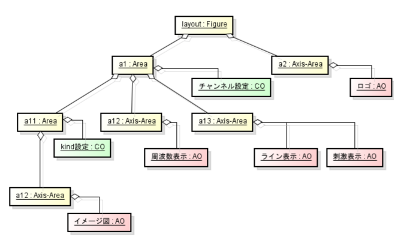
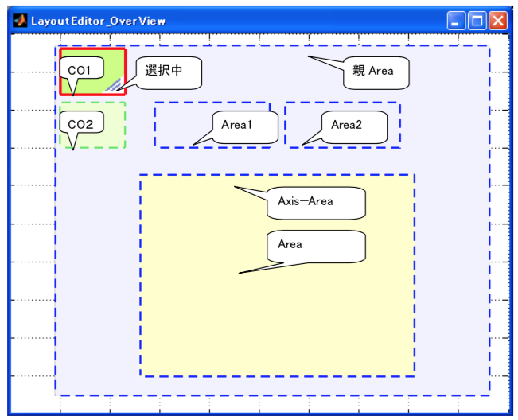
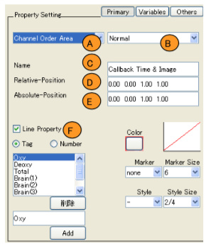
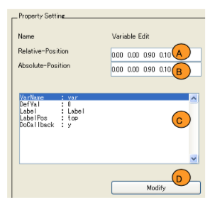
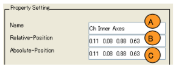
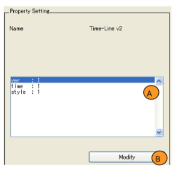

# LAYOUTマニュアル

[Open PoTAToドキュメントリストへ](index.md)

<!-- TOC -->

- [LAYOUTマニュアル](#layoutマニュアル)
- [概要](#概要)
    - [Open PoTAToのデータ描画機能](#open-potatoのデータ描画機能)
    - [LAYOUT](#layout)
    - [ドキュメントの内容](#ドキュメントの内容)
- [Open PoTAToの描画機能](#open-potatoの描画機能)
    - [描画の実行](#描画の実行)
    - [描画内容の変更](#描画内容の変更)
- [Layout Editorの使い方](#layout-editorの使い方)
    - [LAYOUTの構成要素](#layoutの構成要素)
    - [LAYOUTの構造と情報の引継ぎ](#layoutの構造と情報の引継ぎ)
    - [Layout Editor概要](#layout-editor概要)
        - [起動](#起動)
        - [ファイルI/O](#ファイルio)
        - [テスト表示](#テスト表示)
    - [LAYOUTツリー](#layoutツリー)
        - [ツリーの表示](#ツリーの表示)
        - [ツリーの操作](#ツリーの操作)
    - [LAYOUT Overview](#layout-overview)
    - [Figureの設定](#figureの設定)
    - [Areaの設定](#areaの設定)
        - [AreaのPrimary設定](#areaのprimary設定)
        - [AreaのVariables設定](#areaのvariables設定)
        - [AreaのOthers設定](#areaのothers設定)
    - [CO: Control-Object](#co-control-object)
    - [Axis-Areaの設定](#axis-areaの設定)
    - [AO:Axis-Object設定](#aoaxis-object設定)

<!-- /TOC -->

# 概要

## Open PoTAToのデータ描画機能

本書はOpen PoTAToにおけるデータの描画機能について説明します。
Open PoTAToは以下のような表示機能を備えています。

- 様々な表示方法を選択できます

- 表示された図をインタラクティブに変更できます

- 表示方法を変更できます (中級者以上向け)

  

## LAYOUT

Open PoTAToではLAYOUTを使ってデータを描画します。**LAYOUT**とはグラフや画像で表示する内容やそれらの配置を決める仕組みのことです。Open PoTAToではLAYOUTを自由に作成、編集できます。LAYOUTの作成や編集にはLayout Editorを使います。

Open PoTAToではデータをLAYOUTに従って表示します。ここでデータとはOpen PoTAToの解析結果として得られる連続データや区間データおよび要約統計量です。

下図はOpen PoTAToにおける描画の処理の流れです。

## ドキュメントの内容

まず、「Open PoTAToの表示機能」として、操作方法とLAYOUTでできることを説明します。

次に「LAYOUTの編集方法」を説明します。編集に必要となるLAYOUTの構成要素や変数(curdata)の影響範囲(スコープ)についても説明します。

最後に「LAYOUTの拡張方法」を説明します。ここではFigureの制御を行うCOや、実際のデータの描画を行うAOの作成方法について説明します。

# Open PoTAToの描画機能

## 描画の実行

Open PoTAToメイン画面から描画するまでの流れを説明します。

描画の前段階として、解析領域(A)で、表示する解析データを選択しましょう。また、解析手順を適切に編集しましょう。

描画処理を表示するにはLAYOUTをポップアップメニュー(B)から選びます。Open PoTAToではデフォルトで多くのLAYOUTを用意しています。

次にDrawボタン(D)を押すと、(A)で指定した解析に従いOpen PoTAToデータが作成され、(B)のLAYOUTに従ってデータが描画されます。

また、LAYOUTを編集したい場合はEditボタン(C)を押します。ここで編集できるLAYOUTは(B)で選択しているものです。

## 描画内容の変更

描画した図のチャンネルやデータの種類等を変更することができます。

描画内容は、ポップアップメニューやリストボックスで制御パーツを使って変更できます。それぞれの制御パーツはグラフや画像などの描画パーツと関連付けられています。

下図の2つのグラフ(D1), (D2)の描画内容を制御パーツを使って変更する例を説明します。データの種類を制御するリストボックス(A)は(D1)および(D2)に関連付けられていますので、この制御パーツを使うと2つの図を同時に変更できます。一方、チャンネル番号を制御するポップアップメニュー(B)と(C)はそれぞれその上部にあるグラフのみに関連付けられています。つまり、(B)を操作すると(D1)のみが書き換えられ、(C)を操作すると(D2)のみが書き換えられます。

これらの関連付けはLAYOUTの設定で決められています。LAYOUTの設定を編集するにはLayout Editorを使います。

# Layout Editorの使い方

Layout Editorを使うと、LAYOUTを編集したり、追加したりできます。例えば、既存のLAYOUTを編集し、制御パーツや描画パーツを追加し、機能を拡張することができます。

## LAYOUTの構成要素

LAYOUTは**Figure**、**Area**、**Axis-Area**および制御オブジェクト(Control object: **CO**)、描画オブジェクト(Axis Object：**AO**)の5つの要素から構成されています。これらの構成要素を組み合わせることで、LAYOUTに様々な描画機能を持たせることができます。

- FigureはMATLABのfigureのプロパティを書き換えます。FigureはAreaやAxis-Areaと関連付けられています。

- Areaは制御パーツや描画パーツを描画する範囲のことです。Areaそのものは描画されません。Areaには別のArea、Axis-Area、制御を行うためのLayout構成物COが関連付けられています。

- Axis-AreaはMATLAB,のaxesを描画します。

- COはMATLABのGUIパーツ(uicontrolやuimenuなど)を描画するためのオブジェクトです。これらのGUIパーツを使って、描画した図に対してチャンネルやデータの種類等を変更するための情報や処理を持っています。

- AOはAxis-Area内にLineやImageを描画します。AOはこれらの設定・描画・再描画のための処理が含まれます。

LAYOUTの構成物には親子関係があります。親の情報が変更されると子も影響を受けます。LAYOUTの構成要素のうち、Figure、Area、Axis-Areaは親子関係をもち、1つの親には0個以上の子が存在します。Figureは必ず親となり、子にはArea/Axis-Areaを持つことができます。Areaは別のAreaおよびAxis-Areaを子に持つことができます。Axis-Areaは子を持ちません。

また、AreaにはCOが関連付けられています。Axis-AreaにはAOが関連付けられています。

## LAYOUTの構造と情報の引継ぎ

LAYOUTの構成要素のうち、Figure、Area、Axis-Areaの親子関係をもち、1つの親に対して0個以上の子が存在します。Figureは必ず親となり、子にはAreaもしくはAxis-Areaを持つことができます。Areaは別のAreaおよびAxis-Areaを子に持つことができます。Axis-Areaは子を持ちません。

また、AreaにはCOが関連付けられています。Axis-AreaにはAOが関連付けられています。この関係をクラス図で表すと以下のようになります。

これらの親子関係は描画実行時の情報の引継ぎ方法に深く関係しています。描画時には、描画するチャンネル、データの種類、線の色など、描画のための様々な情報があります。これらの情報はcurdata(current-data)構造体にまとめて保存してあり、管理されています。curdataはLAYOUTに含まれる全ての構成要素が持っており、親から子へ引き継がれます。つまり、子や兄弟からは変更されません。

COは関連付けられているAreaのcurdataに従って設定されます。ただし、COで個別にcurdataを設定してある場合には、そのAreaのcurdataが書き換えられます。

AOは関連付けられているAreaのcurdataに従って描画されます。先祖にCOが関連付けられている場合、描画後にCOのCallbackによりcurdataは書き換えられます。

データの影響範囲について、下のLayoutのオブジェクト図を例に説明します。

例にあるLAYOUTを描画するとき、layout:Figureでcurdataが作成されます。layoutの子、a1,a2には同じcurdataが引き継がれます。

a1ではチャンネル設定を行うcoが存在し、curdataのチャンネル値を変更します。この時、a2のcurdataは変更されませんが、その子、a11,a12,a13には変更されたチャンネル値が引き継がれます。

a11にはkindを設定するCOが存在し、curdataのkindを変更します。この結果はイメージ図:AOに引き継がれます。
描画完了後、a1に属するチャンネルCOにより再描画が実施される場合、a1の子孫であるイメージ図、周波数表示、ライン表示、刺激表示が再描画されます。

イメージ図を再描画する際、イメージ図が持つcurdataのうち、チャンネル値のみが更新されイメージが再描画されます。

a12に属するkind設定COにより再描画される場合は、イメージ図のみが再描画されます。この時、イメージ図が持つcurdataのうちkindのみが更新されイメージが再描画されます。

## Layout Editor概要

Layout Editorは2つの画面を用いてLAYOUTを編集します。

１つ目の画面は**Layout Editorメイン画面**です。ここで基本的なレイアウトの編集を行います。左側にLAYOUTツリー、右側に選択中の構成要素のプロパティが表示されます。

2つ目の画面は**Layout Overview画面で**す。ここではメイン画面だけではイメージしにくい概略図の確認を行います。また、構成要素の配置を調整できます。

### 起動

Layout Editorを起動するには2つの方法があります。

LAYOUTを新規作成する場合や編集したいLAYOUTを手動で選択する場合、メニューからLayout Editorを起動します。この時、Open PoTAToメインウィンドウのツールメニューからLayout Editor(A)を選択してください。

Open PoTAToで管理しているLAYOUTを編集する場合、Editボタン(C)を押下します。このときは、ポップアップメニュー(B)で選択されているLAYOUTを編集できます。

### ファイルI/O

Layout Editorが起動するとメイン画面にはFileメニューが存在します。Fileメニューの機能の一覧を下表に示します。

### テスト表示

編集中のLAYOUTの描画を手早く確認したい場合には、Layout Editorメイン画面にあるTest Drawメニューを選択します。編集中のLAYOUTを用いてサンプルデータが描画されます。

なお、サンプルデータは小さなデータで多くの情報が含まれていません。そのため、一部のAOでは期待した値が表示されないことがあります。サンプルデータを変更したい場合は

LayoutEdit\TestData\data0.mat

を変更してください。

## LAYOUTツリー

### ツリーの表示

LayoutはFigure, Area, Axis-Areaおよび,CO、AOの5つの構成要素からなります。また、LAYOUTはFigureをルートとし、Area,Axis-Areaをリーフとする木構造で出来ています。

これを文字列で表現したものが、Layoutツリーリストボックス(A)に示されています。Layoutツリーリストボックスには左から順に構成要素の親子関係が階層で表されています。

Figureは最上段に1つだけあり、LAYOUT名で表示されています。この図では”Line plot”がLAYOUT名です。

Figureの子であるAreaやAxis-AreaはFigureよりもひとつ下の階層で示されます。Areaは[+]、[-]または[]で始まる文字列で表示されています。図では”[-]Callback Time & Image”や”[-]Channel Group C8”等がAreaです。

Axis-Areaは{+}、{-}または{}で始まる文字列で示されます。図では”{-}setting”等がAxis-Areaです。

AreaやAxis-Areaはダブルクリックすることによって展開、もしくは折りたたむことができます。Areaの場合、展開表示されている場合は“[-]“、折りたたまれている場合は”[+]”と表示され、子がない場合は”[]”と表示されます。

Areaに関連付けられているCOは”※”で始まる文字列で表示されています。図では”※StimAreaMenu”等がCOです。

Axis-Areaに関連付けられているAOは”>”で始まる文字列で示されます。図では”>Script”等がAOです。

### ツリーの操作

Layoutツリーを編集するには、操作ボタン(A)と右クリックした際に開くコンテキストメニュー(B)で操作します。パソコンでファイルを扱うときのようにカット＆ペーストやコピーなどができます。<u>ただし、Undo(一つ前の操作を取り消して元にもどす)はできません。</u>

まず、編集したい構成要素をマウスクリックで選択します。選択中の構成要素は網掛けで表示されます。

「カットボタン」や「切り取りメニュー」を使うと、選択中の構成要素をカットできます。選択した構成要素に付随する構成要素（子やCO,AOなど）があれば併せてカットされます。

「コピーボタン」や「コピーメニュー」を使うと、選択中の構成要素をコピーできます。選択した構成要素に付随する構成要素（子やCO,AOなど）があれば併せてコピーされます。

「ペーストボタン」や「貼り付けメニュー」を使うと、コピーもしくはカットにて保存されたデータを貼り付けます。

「削除ボタン」や「Deleteメニュー」を使うと、選択中の構成要素を削除できます。選択した構成要素に付随する構成要素（子やCO,AOなど）があれば併せて削除されます。

「Upボタン」もしくは「Upメニュー」により選択中の構成要素を上に移動します。

「Downボタン」もしくは「Downメニュー」により選択中の構成要素を下に移動します。

移動は同じ階層内に限ります。他の階層へ移動するにはカット＆ペーストを利用ください。

## LAYOUT Overview

Layoutツリーで構成要素を選択すると、その構成要素に関わるものをLAYOUT Overview画面で確認できます。また、LAYOUT Overview画面では構成要素の位置を変更することもできます。

Layoutツリーで構成要素を選択すると、選択されたものはLAYOUT Overview画面で赤い線で囲まれます。選択中の構成要素を移動するには枠をドラッグします。また、サイズを変更するには右下隅をドラッグします。

また、選択中の構成要素に関わる親や兄弟も図示されます。選択中の構成要素の親となるAreaは薄い青で塗られ、青い点線で囲まれた最も広い範囲のものです。親Area内では、AreaとAxis-Areaは青い点線で、COは薄い緑色で塗られた緑色の点線で囲まれます。また、Axis-AreaにAOが関連付けられているときにはAxis-Areaの内部がベージュで塗られます。

## Figureの設定

Layoutの先頭は必ずFigureです。Figureの子はAreaおよびAxis-Areaです。Figureの子を追加するときは、ポップアップメニュー(D)からAreaもしくはAxis-Areaを選択し、Addボタン(E)を押してください。

LayoutツリーでFigureを選択すると、FigureのLAYOUT名、Figureのサイズ、色を設定できます。

- Name(A)はレイアウト選択ポップアップメニューのレイアウト名として使われます。また、FigureのNameプロパティに設定されます。
- Position(B)はFigureの位置を示します。Positionの座標系はディスプレイの左下を[0,0]、右上を[1, 1]としています。左から順に「左、下、幅、高さ」の4つの値で設定します。このような座標系をMATLABでは"Normalized"と呼びます。
- Color(C)はFigureの背景色です。背景色は加色法で規定され、左から順に「赤、緑、青」の3つの値を0~1の範囲で示しています。値の設定にはuisetcolor関数が参考になります。

## Areaの設定

AreaはFigureもしくはAreaの子として作成されます。

LayoutツリーでAreaを選択すると、Areaのプロパティを編集できます。

Areaの子はAreaおよびAxis-Areaです。また、オブジェクトとしてCOを関連付けられます。これらを追加するにはポップアップメニュー(A)からarea, axis, specialcontrolのいずれかを選択し、Addボタン(B)を押してください。なお、special controlは一部のCOを除くCOです。

AreaのプロパティはPrimary, Variables, Othersの3つに大別されています。

PrimaryはAreaの配置や位置を設定します。Variableでは良く使われるCOとして、データの選択、チャンネルの選択、データの種類の選択に関するCOを設定できます。Othersではその他のcurdataを変更できます。

### AreaのPrimary設定

AreaのPrimary設定ではAreaの基本的な設定を行います。

最初に配置方法リストボックス(A)で”Simple Area”もしくは”Channel Order Area”かを選びます。"Simple Area"と”Channel Order Area”の違いは、Areaの子の生成方法です。”Channel Order Area”ではAreaの子をチャンネルの数だけコピーして作成し、Area内に並べて配置します。

”Channel Order Area”を選択するとリストボックス(B)が表示されます。このリストボックス(B)から配置方法を選びます。配置方法は“Normal”を選ぶとOpen PoTAToデータの規定にしたがって表示されます。”Array (Square)”を選ぶと規定を無視して、配列のように順に並べることもできます。

Areaの名前はName(C)で指定します。この名前がツリーに表示されます。

(D)と(E)はAreaの表示位置を示しています。(D)は親からみた相対位置です。(E)はFigure上での絶対位置です。一方を編集すると、他方は自動的に更新されます。LAYOUT Overview画面でドラックでサイズや位置を変更するとこれらの値も自動的に更新されます。座標系(D)は親を(E)はFigureを基準に設定します。基準の左下を[0,0]、右上を[1, 1]として、左から順に「左、下、幅、高さ」の4つの値で設定します。

またArea内のグラフなどの線に関するプロパティ設定をするには、Line Propertyチェックボックス(F)をONにします。ONにすると、線の色や太さを変更することができます。この情報はcurdataとして渡されるため、構成要素ごとに個別のプロパティが設定されている場合はで上書きされます。

### AreaのVariables設定

Variableでは良く使われるCOとして、データの選択、チャンネルの選択、データの種類の選択に関するCOの設定ができます。

最初にAreaのVariableトグルボタンを押下状態にします。

Variable設定では各行にCOの種類が、列に設定値が表示されます。

COの種類は左の文字列(A)に記載されています。文字列の右側にあるチェックボックス(B)でCOの有効/無効を設定します。有効にすると、設定値を編集できます。

(C)ではGUIの表示スタイルを選択します。デフォルトは”None”です。”None”の場合はCOを作成せず、描画時にcurdataを変更します。“None”以外のスタイルが設定されると、COが有効になり、LAYOUTツリーに追加されます。

また、位置を持つスタイルが選択されると相対位置の入力ボックス(D)が表示されます。ここには、関連付けられたArea内での相対位置を記載します。最後にSetボタン(E)で設定します。

### AreaのOthers設定

AreaのOthersトグルボタンを押下状態にするとスクリプトの設定画面が開きます。ここでは、スクリプトを実行することにより、詳細な設定を行います。スクリプトで利用/変更できる変数はcurdata構造体です。curdata構造体のフィールドは任意に追加できます。主要なフィールドは以下の通りです。

| フィールド名        | 内容                                           | 例           |
| ------------------- | ---------------------------------------------- | ------------ |
| region              | 解析データの種類 (Continuous/Block/Summary) | ‘Continuous’ |
| cidmax              | 連続データの数                                 | 1            |
| bidmax              | ブロック数                                     | 2            |
| time                | 時刻範囲                                       | [-Inf Inf]   |
| ch                  | チャンネル番号                                 | 1            |
| kind                | データの種類                                   | [1 2]        |
| gcf                 | 描画中のfigureハンドル                         | 2            |
| menu_current        | メニューハンドル                               | 10.01        |
| path                | Curdata 所有構成物の LAYOUT内の構成要素位置 | [1 2 2]      |
| LineProperty        | 線のプロパティ <(通常 GUI で設定)>             | -            |
| CommonCallback-Data | 共通CO参照用データ                             | -            |

次のようなレイアウトを例にスクリプト作成例を示します。Area "Callback TIme Image" のスクリプトに”curdata.foovar=10”と記述しています。

## CO: Control-Object

COはAreaに関連付けられるオブジェクトとして作成され、子を持ちません。

COをLayoutツリーで選択すると編集画面が表示されます。

編集画面では、COの位置と固有のプロパティを設定します。

(A)と(B)はそれぞれ親からみた相対位置とFigure上での絶対位置です。詳細はAreaのPrimary設定と同様です。

COに固有の値はリストボックス(C)に表示されます。これらを変更するにはModifyボタン(D)を押します。

## Axis-Areaの設定

Axis-AreaはFigureもしくはAreaの子として作成されます。子は持ちませんが、関連付けられるオブジェクトとしてAOを持ちます。

(A)はAxis-Areaの名称です。

(B)と(C)はそれぞれ親からみた相対位置とFigure上での絶対位置です。詳細はAreaのPrimary設定と同様です。

Axis内にAOを追加するには、画面左下のAOポップアップメニュー(A)からAOを選択し、Addボタン(B)を押してください。

## AO:Axis-Object設定

AOはAreaに関連付けられるオブジェクトとして作成され、子を持ちません。

AOをLayoutツリーで選択すると編集画面が表示されます。

編集画面では、AOの固有のパラメータを設定します。設定済みのAO固有パラメータがリストボックス(A)に表示されます。この値を、変更したい場合、Modifyボタン(B)を押します。

# 発展

LAYOUT機能を拡張するには[描画機能マニュアル-拡張編](LayoutEditor-advanced.md)をご覧ください。

