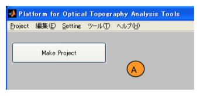
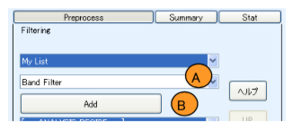
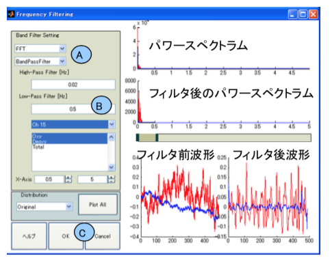

# Open PoTAToファーストステップガイド
[Open PoTAToドキュメントリストへ](index.md)

<!-- TOC -->

- [Open PoTAToファーストステップガイド](#open-potato%E3%83%95%E3%82%A1%E3%83%BC%E3%82%B9%E3%83%88%E3%82%B9%E3%83%86%E3%83%83%E3%83%97%E3%82%AC%E3%82%A4%E3%83%89)
- [解析してみよう](#%E8%A7%A3%E6%9E%90%E3%81%97%E3%81%A6%E3%81%BF%E3%82%88%E3%81%86)
    - [起動](#%E8%B5%B7%E5%8B%95)
    - [プロジェクトの作成](#%E3%83%97%E3%83%AD%E3%82%B8%E3%82%A7%E3%82%AF%E3%83%88%E3%81%AE%E4%BD%9C%E6%88%90)
    - [実験データの読み込み](#%E5%AE%9F%E9%A8%93%E3%83%87%E3%83%BC%E3%82%BF%E3%81%AE%E8%AA%AD%E3%81%BF%E8%BE%BC%E3%81%BF)
    - [Normalモードでの解析](#normal%E3%83%A2%E3%83%BC%E3%83%89%E3%81%A7%E3%81%AE%E8%A7%A3%E6%9E%90)
- [解析方法のカスタマイズ](#%E8%A7%A3%E6%9E%90%E6%96%B9%E6%B3%95%E3%81%AE%E3%82%AB%E3%82%B9%E3%82%BF%E3%83%9E%E3%82%A4%E3%82%BA)
    - [解析モードの変更](#%E8%A7%A3%E6%9E%90%E3%83%A2%E3%83%BC%E3%83%89%E3%81%AE%E5%A4%89%E6%9B%B4)
    - [Preprocess 画面](#preprocess-%E7%94%BB%E9%9D%A2)
    - [解析の追加](#%E8%A7%A3%E6%9E%90%E3%81%AE%E8%BF%BD%E5%8A%A0)
    - [周波数フィルタ](#%E5%91%A8%E6%B3%A2%E6%95%B0%E3%83%95%E3%82%A3%E3%83%AB%E3%82%BF)
    - [連続データの区間分け](#%E9%80%A3%E7%B6%9A%E3%83%87%E3%83%BC%E3%82%BF%E3%81%AE%E5%8C%BA%E9%96%93%E5%88%86%E3%81%91)
    - [レシピ編集](#%E3%83%AC%E3%82%B7%E3%83%94%E7%B7%A8%E9%9B%86)

<!-- /TOC -->


この文書 はOpen Platform of Transparent Analysis Tools for functional near infrared spectroscopy (Open PoTATo)のステップガイドです。 

ここでは典型的な実行例を通して Open PoTATo の基本的な操作を説明します。

Open PoTAToには簡単に解析ができる**Normalモード**と、解析方法をカスタマイズできる**Researchモード**の2つのモードがあります。解析モードはメニューから簡単に切り替えることができます。(開発者向けのモードもありますが、ここでは説明しません。)

I)	[解析してみよう](#解析してみよう)ではOpen PoTAToを起動し、Normal モードの基本的な解析フローによってグラフを表示するところまでを試してみましょう。

II)   [解析方法のカスタマイズ](#解析方法のカスタマイズ)ではResearch モードで解析手法をカスタマイズする例を示します。Open PoTAToは解析手順を記述したものを**Recipe(レシピ)**と呼びます。例では実験データを解析するためのRecipeの作成や編集の方法を示します。


# 解析してみよう

Open PoTATo は様々なfNIRS装置から出力されたデータを読み込むことが可能です。 また、それらの実験データを簡単な操作で解析することができます。
ここでは、Normal モードによる最もシンプルな Open PoTATo の操作方法を説明します。 ここでは、Open PoTAToの起動、プロジェクトの作成、実験データの読み込み、解析の選択、結果の表示を説明します。

## 起動
まず、MATLABを起動します。


MATLABの起動画面が表示されますので、起動が完了するのを待ちます。
MATLABが起動したら、Open PoTAToをインストールしたディレクトリに移動します。次にCommand Window上で、P3とタイプし、Enterキーを押してください。


その結果、Open PoTAToが起動します。


## プロジェクトの作成

Open PoTATo で扱うデータは**プロジェクト**と呼ばれる単位で管理されます。プロジェクトは解析対象とする実験データをひとまとめにしたものです。例えば、実験テーマごとにプロジェクトを作成すると、データを管理しやすくなるかもしれません。

まず、プロジェクトの作成方法について説明します。プロジェクトを作成するには、プロジェクトが開いていない状態で Make Project ボタン(A)を押します。




このとき、プロジェクト作成ウィンドウが表示されますので、プロジェクトに関する情報を設定します。 ここでは、Project Name エディットテキスト(A)にtest と記入し、New ボタン(B)を押します。 その結果、プロジェクトが作成され、実験データが読み込み可能になります。


## 実験データの読み込み 

作成したプロジェクトにはデータが含まれていません。このプロジェクトに実験データを読み込みます。Open PoTATo では実験データの読み込みを**インポート**と呼びます。プロジェクトに実験データをインポ ートするには Import Data ボタン(A)を押します。


 Import Data ボタンを押すと、Data Import ウィンドウが現れます。実験データは下記の手順でインポートします。

1. インポートする実験データを選択します。
Add file(s)ボタン(A)を押すと、ファイル選択ウィンドウ(b0)が表示されます。実験データのファイルが格納されているフォルダを Browse ボタン で(b1)から選択し、読み込みたいファイルをリストボックス(b2)から選択します。

2. ファイルが選択されるとリストボックス(B)にファイルが追加されます。 この状態ではファイルの情報を読んだだけで、データそのものは読み込まれていません。リストボックスの情報を確認して、不要なファイルがあれば、Remove fileボタンを使って、リストからファイルを除外します。

3.  Execute ボタン(C)を押すとデータがインポートされます。


## Normalモードでの解析とデータ表示
実験データをインポートするとメインウィンドウは下記のようになります。

```markdown
## 注意 ## 
Normal モードになっていない場合は 
Setting メニューの P3 Mode から Normal Mode を選択してください
```

1. 実験データから読み込んだ解析データを１つデータリストボックス (A)から選択します。 

2. 解析手順をRecipeポップアップメニュー(B)から選びます。ここではYamada2018SciRepを選択します。Yamada2018SciRepの概略説明がDescriptionリストボックス  (C)に示されます。

3. に Draw ボタン(D)を押し、結果を描画します。Line Plotとなっているポップアップメニューからは様々な表示方法を選択できます。


なお、”Yamada2018SciRep”の 実行には  MATLAB signal  processing  ツールボックスで提供される関数、butterworth が必要です。


データ表示の例を示します。データの種類(Oxy/Deoxyなど)、刺激の種類(Mark)を選択するGUI(A)や、チャンネルの詳 細な情報 (B)、トポグラフィ画像 (C)が表示されています。


なお、Yamada2018SciRep の解析の概略説明は下記の通りです。

``` markdown
## Yamada2018SciRep:解析内容##
191129

# Summary
課題は 2 種類(左手餌取り: 1, 右手餌取り: 2);各条件 75 回を交互に試行
課題間時間 20秒以上

3次の多項式フィッティングによってベースライン変動の除去
0.7HzのLow Pass Filtering によってノイズ除去
刺激開始前 5 秒間、刺激開始後 30 秒間からなる 35 秒を用いてブロック化

# Information
Tag: Yamada, 2018 SciRep
Title: Functional near-infrared spectroscopy for monitoring macaque cerebral motor activity during voluntary movements without head fixation
Authors: Yamada T, Kawaguchi H, Kato J, Matsuda K & Higo N
Journal: Scinentific Reports 2018 Aug 09;8:1194.

# Description of Recipe
* Both Oxy-Hb and Deoxy-Hb signals were used in this study.
1. Baseline correction (Continuous)
	- Degree: 3
  - UnFitPeriod: N/A
2. Bandpass filtering
	- Filter Function: ButterWorth
  - Dimension for butter: 4
  - Filter Type: LowPassFilter
	- Low-Pass Filter [Hz]: 0.7
3. Blocking
  - Pre-task period: 5 [s]
  - Post-task period: 15 [s]
  - Using Marker: All
```


# 解析方法のカスタマイズ

Open PoTATo では解析手順(レシピ)を編集・保存することで、自由度の高い再利用可能な解析ができます。ここでは Open PoTATo の Research モード内の解析準備機能”Preprocess”を利用します。この例では1つの実験データのみに注目し、ノイズ除去やデータの切り取りなどを行います。

起動および実験データの読み込みは完了しているものとします。このような基本操作は上述の[解析してみよう](#解析してみよう)をご参照ください。

ここでは解析準備としてよく行われる例を説明します。本ステップガイドの解析は多くの実験データに応用できます。


## 解析モードの変更
Open PoTATo を Research モードに変更してみましょう。
変更するにはメインウィンドウの Setting メニュー、P3 MODE から、Research Mode を選択してください。


## Preprocess 画面

次に Open PoTATo を解析準備状態に設定します。

Research モ ード 画面 の Preトグルボタン (A) を押します。 そうする と 解析準備状態 (Preprocess)に移行し Preトグルボタンの表示が Preprocessに変わります。


Preprocessでは左側のリストボックスで選択した解析データに対して、解析手順(Recipe)を設定します。


## 解析の追加
Preprocess  におけるメインウィンドウ右側に、選択中の実験データに対する解析手順(Recipe)の設定・編集画面が表示されます。
本ステップガイドでは、以下の２つの処理を行うレシピを作成します。

- ノイズ除去のために周波数フィルタをかける。

- 複数の刺激をもつ時間的に連続している“連続データ”を刺激区間毎に取り出した“区間データ”に変換する。

  

## 周波数フィルタ

ノイズ除去のために周波数フィルタを設定します。フィルタの追加はフィルタポップアップメニュー(A)から追加するフィルタとして“Band Filter”を選択し、Add ボタン (B)を押します。




このとき Band Filter のパラメータ 設定ウィンドウが表示されます。フィルタのタイプとしてはFFTを用いた周波数フィルタの、Bandpass Filter(A) を選びます。 また Low-Pass (B)をデフォルト値の0.8 から 0.5 [Hz]に変更します。このとき、フィルタリング前後の波形などを画面で確認できます。最後にOKボタン (C)を押します。




レシピを示すリストボックス (C)にBand Filterが追加されます。設定したパラメータは  “>”以降に記載されています。


## 連続データの区間分け

次に複数の刺激を持つ  “連続データ”を刺激区間毎 取り出した“区間データ”に変換します。フィルタポップアップメニューから追加するフィルタとして“Blocking”を選択し、 Addボタンを押します。 そうすると設定画面が表示されるので、このままOKを押 します。


この解析は以下のような処理になります。

例えば、”連続データ”として2回の刺激をもつデータが存在したとします。


この２つの刺激を含む連続なデータを、設定に従い刺激毎に２つに分けます。

 

この区間に分けたデータ1つ1つを**ブロック**と呼び、以降の処理はブロック単位で行います。


## レシピ編集
結果を Draw ボタンで確認したところ下図のように、10 秒間に2, 3の山をもつノイズが見られたとしましょう。そこで周波数フィルタで 0.2 Hz より高い周波数のデータもカッ トするよう変更してみましょう。

```markdown
### 注意 ###
ここでは便宜上ノイズとしています。 実際にノイズかどうかは検証が必要です。
```


まず、レシピ情報リストボックス (A)から、周波数フィルタであるBand Filterを選択します。次に、Changeボタン (B)を押します。


その結果、再度パラメータ設定ウィンドウが開かれる のでパラメータ設定ウィンドウの Low-Pass を 0.5 から 0.2 に変更し、0.2 より低い周波数のみ有効にします。


結果、ノイズが除去された波形が得られました。


```markdown
### Tips ###
フィルタの順序設定は”UP”、“Down”にて変更できます。 
レシピはロード・セーブボタンによりファイルに保存できます。
解析の詳細内容を見たい場合、実行手順をスクリプトM-ファイルに変換出来ます。
解析方法を公開しているフィルタはこの機能によりソースコードを参照できます。
```


[Open PoTAToドキュメントリストへ](index.md)

